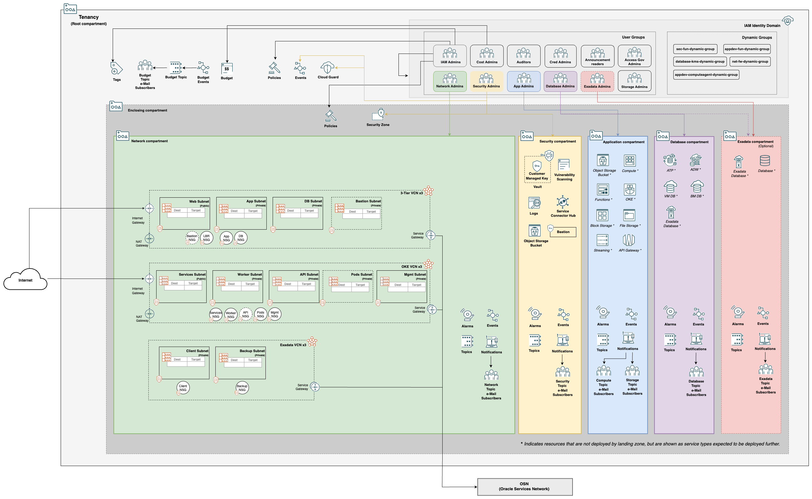
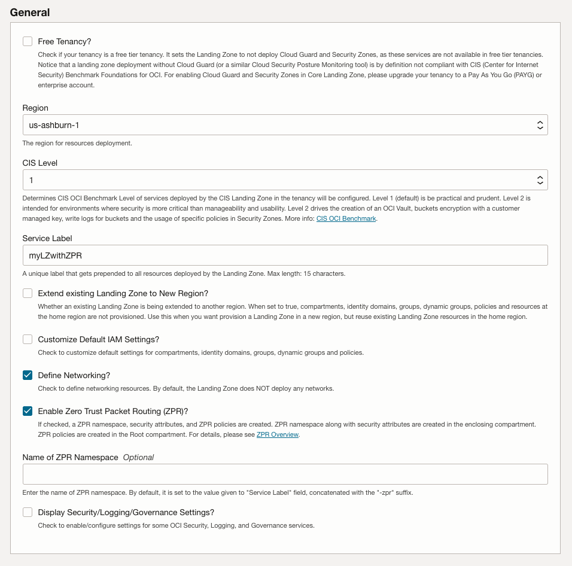

# Table of Contents

1. [Introduction](#introduction)
1. [Considerations](#considerations)
    1. [Access Permissions](#access-permissions)
    1. [Green Field and Brown Field Deployments](#green-field-and-brown-field-deployments)
    1. [Networking](#networking-2)
    1. [Managing State](#managing-state)
1. [Architecture](#architecture)
    1. [Identity & Access Management (IAM) Configuration](#iam-configuration)
    1. [Network Configuration](#network-configuration)
    1. [Governance](#governance-3)
1. [Deployment Scenarios](#scenarios)
    1. [Identity & Access Management](#iam)
    1. [Networking](#networking-4)
    1. [Governance](#governance-4)
    1. [Security Services](#security-services)
    1. [Deploying Lifecycle Environments](#deploying-lifecycle-environments)
    1. [Zero Trust Packet Routing (ZPR) Use](#zpr-use)
1. [Ways to Deploy](#ways-to-deploy)
    1. [Deploying with Terraform CLI](#deploying-with-terraform-cli)
    1. [Deploying with OCI Resource Manager UI](#deploying-with-orm-ui)
    1. [Deploying with OCI Resource Manager CLI](#deploying-with-orm-cli)

# <a name="introduction"></a>1. Introduction

Customers often ask us about best practices when deploying to OCI and how to automate that deployment for creating a secure tenancy. In response, we have created the OCI Core Landing Zone Reference Implementation.

This reference implementation (referred to as the **Landing Zone** in the rest of this document) is a blend of CIS (Center for Internet Security) Foundations Benchmark for OCI recommendations with OCI architecture best practices, provided as Terraform code, resulting in an opinionated, configurable, and automated deployment approach for OCI.

The [CIS Oracle Cloud Infrastructure Foundations Benchmark]( https://www.cisecurity.org/benchmark/oracle_cloud) provides prescriptive guidance when working with OCI as it defines fundamental security principles that do not require any further mapping or refinement. The benchmark recommends: *"Ensure service level admins are created to manage resources of particular service"*, *"Ensure no network security groups allow ingress from 0.0.0.0/0 to port 22"*, *"Ensure Cloud Guard is enabled in the root compartment of the tenancy"*. The benchmark also defines configuration profiles, relating to criticality levels of particular security controls. Version 1.1 of the document defines two configuration profiles: level 1 and level 2. Items in Level 1 intend to be practical and prudent, providing security focused best practice hardening of a technology. Level 2 extends level 1 and is intended for environments where security is more critical than manageability and usability, acting as defense-in-depth measure.

The benchmark document does not include guidance on architectural best practices for OCI, for example: compartment design, network topology, connectivity/routing patterns, lifecycle environments, and how these aspects fit together into a cohesive implementation. The Landing Zone accounts for all these requirements and can be used *as is*, customized or used as a model for other implementations.

Customers do not incur any costs when deploying the Landing Zone and the code is publicly available in GitHub [https://github.com/oci-landing-zones/oci-core-landingzone](https://github.com/oci-landing-zones/oci-core-landingzone) under the OCI Landing Zones project. The main idea behind Landing Zone is to allow for fast enablement of security guard rails where workloads can be subsequently deployed safely. Users are not required to have extensive Terraform knowledge to use the Landing Zone *as is* and should be able to deploy it after entering a few configuration variables.

Landing Zone does not provision any resources where workloads are directly executed on, like Compute instances, Databases, Containers, or Functions. Instead, it provides the appropriate placeholders and attachment points for such resources. As a mental model, picture the Landing Zone as an airport, where choppers (workloads) can land safely. For example, the Landing Zone provides the compartment where databases are expected to be created along with the OCI IAM policies and groups that allow database administrators to manage databases. Additionally, it provides the network structures that database administrators should use when provisioning a database, like subnets and NSGs (Network Security Groups). On top of that, Landing Zone configures various OCI services for a strong security posture.

The Landing Zone team monitors OCI services and evaluates new additions and updates, balancing simplicity and flexibility for providing a secure and well architected tenancy for enterprises in OCI.

# <a name="considerations"></a>2. Considerations

## <a name="access-permissions"></a>2.1 Access Permissions

The Landing Zone can be run as the tenancy administrator (any user that is a member of the Administrators group) or as a user with narrower permissions.

By default, Landing Zone requires tenancy administrator permissions in the tenancy to deploy because it needs to create policies and compartment at the **root** compartment. Depending on a customer’s specific requirements, it also be created in an enclosing compartment up to five levels under the **root** compartment with the groups and dynamic groups residing in the **root** compartment.

## <a name="green-field-and-brown-field-deployments"></a>2.2 Green Field and Brown Field Deployments

The Landing Zone can be used in new OCI tenancies (Green Field) and existing OCI tenancies (Brown Field). To avoid name clashing, the Landing Zone has a configuration variable called *service\_label* that is prefixed to the name for all provisioned resources.

For a Green Field OCI tenancy deploying becomes a matter of provisioning the Landing Zone and then adding any other resources on top of it. This is the simplest deployment scenario.

One option for Brown Field OCI tenancy is to deploy the Landing Zone and then existing resources can be manually moved to Landing Zone compartments, which makes them automatically subject to Landing Zone segregation of duties implementation. Another is to deploy the Landing Zone alongside the existing workload(s) and use the Landing Zone for new workloads.

As we will see in the next section, the Landing Zone can provision different network topologies. However, some customers may want to bring in their own VCN (Virtual Cloud Network) and this may disrupt Landing Zone network architecture principles, as best practices may have not been followed. These pre-existing VCNs can be moved to Landing Zone Network compartment. In this case, a thorough review of routing and security rules is required for ensuring connectivity paths are properly secured.

An existing DRG can be brought into Landing Zone just by supplying its OCID to *existing\_drg\_id* configuration variable. This is useful for customers who already have setup connectivity to their on-premises network via FastConnect or Site-to-Site IPSec VPN.

Routing rules or network security rules required by specific workloads are handled by customizing the Landing Zone configuration in *net\_three\_tier\_vcn\_1.tf*, *net\_three\_tier\_vcn\_2.tf*, *net\_three\_tier\_vcn\_3.tf*, *net\_exacs\_vcn\_1.tf*, *net\_exacs\_vcn\_2.tf*, *net\_exacs\_vcn\_3.tf*, *net\_oke\_vcn\_1.tf*, *net\_oke\_vcn\_2.tf*, *net\_oke\_vcn\_3.tf* and *net\_hub\_vcn.tf*).

## <a name="networking-2"></a>2.3 Networking

The Landing Zone can provision a variety of network topologies to meet the needs of different organizations. While many resources in Landing Zone including networking can easily be updated by changing variables, these changes may cause a resource like a VCN (Virtual Cloud Network) or a subnet to be destroyed. However, these resources cannot be destroyed if they contain resources in them, like compute instances or databases. Due to this, it is recommended to consider the following areas before you begin your deployment:

1. Type of Workload
1. Number of Workloads
1. Network Security between Workloads
1. Connectivity to the Internet
1. Connectivity to the organization's corporate network

### Type of Workload
The Landing Zone supports three workload types: a Three-Tier application, Exadata Cloud Service (ExaCS) and Oracle Kubernetes Engine (OKE).

#### **Three-Tier Application**


A Three-Tier application uses a multi-tier networking model. The three tiers are commonly defined as the presentation tier, the application processing tier and the data management tier. A function-specific network subnet isolates each tier from the others. In the Landing Zone, the three subnets are as follows: the presentation tier is the public *Web* subnet, the application presentation tier is the *App* subnet and the data management tier is the *DB* subnet.

#### **Exadata Cloud Service**


Exadata Cloud Service allows you to leverage the power of Exadata in the cloud. Exadata Cloud Service systems integrate Oracle's Exadata Database Machine hardware with the networking resources needed to securely connect to your organizations on-premise network and to other services in the Oracle cloud.

Exadata Cloud Service instances require a VCN with at least two subnets in the VCN. The two subnets required are the *Client* subnet and the *Backup* subnet.

#### **Oracle Kubernetes Engine**


Oracle Container Engine for Kubernetes (OKE) is a fully managed, scalable, and highly available Kubernetes service based on the open-source Kubernetes system. OKE provides auto-scaling support, automatic Kubernetes cluster upgrades, and self-healing cluster nodes.

An OKE cluster requires a VCN with at least five subnets in the VCN. The required subnets are the public *Services*, *Management* and the private *API*, *Workers* and *Pods* subnets.

## <a name="managing-state"></a>2.4 Managing State
When working with Terraform, a key consideration is how to manage state. Terraform works by reconciling differences between the desired state of the infrastructure with the actual state of infrastructure. The desired state is expressed in the configuration files (the *.tf* files), while the actual state is managed by Terraform, typically expressed in *terraform.tfstate* file.

There are a few crucial aspects to consider when managing state:

- **Terraform state must be protected against unintentional changes**: as stated in [Use refresh-only mode to sync Terraform state](https://developer.hashicorp.com/terraform/tutorials/state/refresh), *"Terraform relies on the contents of your workspace's state file to generate an execution plan to make changes to your resources. To ensure the accuracy of the proposed changes, your state file must be up to date."* Terraform state is readable text. Unless you have 100% confidence in what you are doing, do not update state manually. Let Terraform manage it or use [Terraform CLI state command](https://developer.hashicorp.com/terraform/cli/commands/state) if you absolutely need to make a manual change.

    Terraform automatically backs up the state file in *terraform.tfstate.backup* in the same folder as *terraform.tfstate*. Use that in case you cannot recover from a corrupted or lost *terraform.tfstate*.

- **One state tracks one and only one configuration**: when you provision a Landing Zone environment with one set of configuration variables, Terraform manages that infrastructure in one state file. It is normal and expected to change variable values over time. Terraform would simply update your infrastructure accordingly and those changes are reflected in the state file. **Do Not** manage a new Landing Zone environment in a new region using the same configuration by simply changing the region variable and running it. That would destroy the previous environment because there is a single state file.

- **To manage different environments with the same Terraform configuration:**
    You have two options:
    - via Terraform CLI, use [Terraform workspaces](https://www.terraform.io/language/state/workspaces).
    - via OCI Resource Manager, create a separate Stack for each Landing Zone environment.


- **Terraform may overwrite changes made via other means to its managed resources**: when you provision infrastructure resources with Terraform, it is expected that those resources are going to be managed via Terraform. However, there are situations where quick changes are made outside Terraform, like via the OCI Console. If you resume using Terraform later, those changes will be detected and Terraform will inform you that those changes will be overwritten. You can either accept that or import those resource changes into the state file. Terraform can import existing resources into the state, but it does not generate configuration. Therefore, before importing existing resources, it is necessary to manually add the imported resources into the configuration files. This approach is recommended for advanced users only and is out of the scope of this document.

> **_NOTE:_** one common pattern is using the Landing Zone template to get a tenancy bootstrapped securely and subsequently use different means to manage the resources. This pattern is prevalent in organizations who are still maturing their Infrastructure as Code practices or in proof-of-concept scenarios.

- **Source-controlling state is risky**: when working in a team environment, it's tempting to source control the state file along with the *.tf* files. Resist this temptation. Terraform state can contain sensitive information and working against the same version of the state file is challenging, as there maybe parallel work occurring at any point in time. The recommended approach is using a remote backend with state locking (which is out-of-box available in OCI Resource Manager).


# <a name="architecture"></a>3. Architecture

The Landing Zone architecture starts with a compartment design for the tenancy along with OCI IAM user groups and OCI IAM policies for segregation of duties. Landing Zone compartments may also be deployed within a designated enclosing (parent) compartment. Each Landing Zone compartment is assigned a group with the appropriate permissions for managing resources in the compartment and for accessing required resources in other compartments.

> **_NOTE:_** using an enclosing compartment reduces the blast radius of the IAM Administrator group to the enclosing compartment.

The Landing Zone can provision one to ten VCNs, either in standalone mode or as constituent parts of a Hub & Spoke architecture. The VCNs can either follow a general-purpose standard N-Tier network topology or oriented towards specific topologies, like supporting Oracle Database Exadata Cloud Service and/or Oracle Kubernetes Engine deployments. VCNs are automatically configured with the necessary routing and with the necessary inbound and outbound interfaces properly secured.

The Landing Zone includes multiple pre-configured security services that can be deployed in tandem with the overall architecture for a stronger security posture. These services are *Oracle Cloud Guard*, *Flow Logs*, *Service Connector Hub*, *Vault*, *Vulnerability Scanning*, and *Bastion*.

From a governance perspective, *Notifications* and *Alarms* are setup to use *Topics* and *Events* for alerting administrators about changes and exceeded metric thresholds for deployed resources. The Landing Zone provisions tag defaults to automatically determine resource owner and creation timestamp. Based on user choice, a foundational *Budget* for cost tracking purposes can be created as well.

As an important aspect to governance, logging is also considered by the Landing Zone. Per CIS Oracle Cloud Infrastructure Benchmark, VCN flow logs and Object Storage logging are enabled by default. Landing Zone takes a step forward and, upon user choice, uses Service Connector Hub service to consolidate OCI log sources into a single designated target, which is an Object Storage bucket by default but can also be an OCI Stream or an OCI Function. Such feature makes it easier for making OCI logs available in 3rd-party SIEM solutions, like Splunk.

The diagrams below shows Landing Zone overall architecture:

**With Simple Networking**



**With Hub & Spoke Networking**


## <a name="iam-configuration"></a>3.1 Identity & Access Management (IAM) Configuration

The Landing Zone’s IAM model seeks to enforce segregation of duties and the least privilege principle, by defining compartments, policies, groups and dynamic groups. Existing users can be optionally added to groups, but are not created. The segregation of duties concept is implemented by granting groups *manage* permissions over specific resources on specific compartments. At the same time, other groups are entitled narrower permissions on those same resources. For instance, network administrators are granted *manage* permission over the networking resources in the *Network* compartment. Other groups, like database administrators, are granted *read* permission on *virtual-network-family* in the *Network* compartment and *use* permission on *vnics*, *subnets* and *network-security-groups*, so the databases they provision can make proper use of the network.

### Identity Domains

#### Default Domain
Each tenancy includes a Default identity domain created in the root compartment that contains the initial tenant administrator user and group and a default Policy that allows administrators to manage any resource in the tenancy. The Default identity domain lives with the life cycle of the tenancy and can't be deleted.

#### Custom Domain
Landing Zone allows for the usage of custom identity domains groups and dynamic groups to manage/access its managed resources. A bespoke identity domain is useful when you need a separate environment for a cloud service or application (for example, one environment for development and one for production). For added security, you can configure each identity domain to have its own credentials (for example, Password and Sign-On policies).

Landing Zone uses policies, groups and dynamic groups in a custom identity domain for security based segregation of roles and workload administration.

### Compartments

At least four compartments are provisioned:

- **Security**: holds security resources that are primarily managed by security administrators. Services and resources include Cloud Guard, Vaults, Keys, Vulnerability Scanning, Bastion, and Service Connector Hub.

- **Network**: holds network resources that are primarily managed by network administrators. Services include VCN (Virtual Cloud Network) and DRG (Dynamic Routing Gateway).

- **Application**: designed to hold services oriented for the application portion of workloads that are primarily managed by application administrators. Services include Compute instances, Storage, Functions, and Kubernetes clusters.

- **Database**: designed to hold database services that are primarily managed by database administrators.

Two extra compartments can be provisioned based on user choice:

- **Exainfra**: designed to hold Exadata infrastructure resources that are primarily managed by Exadata administrators. It is recommended for customers where Exadata infrastructure and databases are managed by different groups.

- **Enclosing compartment**: designed to enclose the aforementioned compartments in a single top compartment. When deploying as a non administrator, an enclosing compartment is mandatory.

### Groups

By default, the Landing Zone defines the following personas that account for most organization needs:

- **IAM Administrators**: manage IAM services and resources including compartments, groups, dynamic groups, policies, identity providers, authentication policies, network sources, tag defaults. However, this group is not allowed to manage the out-of-box *Administrators* and *Credential Administrators* groups. It's also not allowed to touch the out-of-box *Tenancy Admin Policy* policy.
- **Credential Administrators**: manage users capabilities and users credentials in general, including API keys, authentication tokens and secret keys.
- **Cost Administrators**: manage budgets and usage reports.
- **Auditors**: entitled with read-only access across the tenancy and the ability to use cloud-shell to run the *cis\_reports.py* script.
- **Announcement Readers**: for reading announcements displayed in OCI Console.
- **Security Administrators**: manage security services and resources including Vaults, Keys, Logging, Vulnerability Scanning, Web Application Firewall, Bastion, Service Connector Hub, ZPR.
- **Network Administrators**: manage OCI network family, including VCNs, Load Balancers, DRGs, VNICs, IP addresses, OCI Network Firewall.
- **Application Administrators**: manage application related resources including Compute images, OCI Functions, Kubernetes clusters, Streams, Object Storage, Block Storage, File Storage.
- **Database Administrators**: manage database services, including Oracle VMDB (Virtual Machine), BMDB (Bare Metal), ADB (Autonomous databases), Exadata databases, MySQL, NoSQL, etc.
- **ExaCS Administrators** (only created when ExaCS compartment is created): manage Exadata infrastructure and VM clusters in the ExaCS compartment.
- **Storage Administrators**: the only group allowed to delete storage resources, including buckets, volumes and files. Used as a protection measure against inadvertent deletion of storage resources.
- **Access Governance**: the group used by the Access Governance instance to query OCI services in the tenancy.

> **_NOTE:_** following least privilege principle, groups are only entitled to manage, use, read or inspect the necessary resources to fulfill their duties.

### Dynamic Groups

The Landing Zone defines four dynamic groups to satisfy common needs of workloads that are eventually deployed:

- **Security Functions**: to be used by functions defined in the Security compartment. The matching rule includes all functions in the Security compartment. An example is a function for rotating secrets kept in a Vault.
- **AppDev Functions**: to be used by functions defined in the AppDev compartment. The matching rule includes all functions in the AppDev compartment. An example is a function for processing of application data and writing it to an Object Storage bucket.
- **Compute Agent**: to be used by Compute's management agent in the AppDev compartment.
- **Database KMS**: to be used by databases in the Database compartment to access keys in the Vault service.
- **Fortigate Network Appliance**: to be used by Fortigate network appliances to read resources.

### Policies

The Landing Zone policies implement segregation of duties and follow least privilege across the different personas (groups). Segregation of duties is implemented by granting specific permissions to a single target group on a single target compartment. For example, only *Network Administrators* can manage the network family, and this is done only in the *Network* compartment. Only *Database Administrators* can manage databases, and this is done only in the *Database* compartment. Least privilege is followed when deploying a database, *Database Administrators* are entitled to use the network managed by *Network Administrators* in the *Network* compartment. Some policies are common to all groups, like the ability to use Cloud Shell in tenancy and to manage Resource Manager stacks in their specific compartments. The policy list is extensive, comprehensive, and human-readable. We recommend reviewing *config/iam\_policies.tf* for additional details.

Policies are attached at different compartments depending on the presence of an enclosing compartment. If Landing Zone compartments are deployed directly under the Root compartment (thus no enclosing compartment), all policies are attached to the Root compartment. If Landing Zone compartments are deployed within an enclosing compartment, some policies are attached to the Root compartment, while some are attached to the enclosing compartment itself. This is to allow for free movement of Landing Zone compartments without the need to change policy statements. The policies at Root compartment are applied to resources at the tenancy level.

In OCI, services also need to be explicitly granted. The Landing Zone provisions policies authorizing Cloud Guard, Vulnerability Scanning Service and OS Management Service the necessary actions for their functioning. We recommend reviewing *config/iam\_service\_policies.tf* for additional details.

### Integration with Pre-existing Identity Domains

The Landing Zone now provides the ability to integrate groups and dynamic groups from an existing identity domain as the grantees of IAM policies.

## <a name="network-configuration"></a>3.2 Network Configuration

The Landing Zone supports a variety of networking types:

- **Standard Three-Tier Web Application VCN**: up to four subnets are provisioned, one to host load balancers, one for application servers (middle-tiers) and one for database servers. Optionally, a subnet (either public or private) for jump hosts is available. The load balancer subnet can be made either public or private. The application servers' and database servers' are always created private. Route rules and network security rules are configured based on provided connectivity settings.

- **Exadata Cloud Service (ExaCS) VCN**: two private subnets are provisioned, according to ExaCS requirements. One subnet for the Exadata client (the database itself) and one for database backups. Route rules and network security rules are configured based on ExaCS requirements and provided connectivity settings.

- **Oracle Kubernetes Engine (OKE) VCN**: one public and up to four private subnets are provisioned, according to OKE requirements. Public facing is the Services subnet, where service like load balancers are expected to be deployed. The others are Workers, API, Management and Pods (available for Native Pod Networking CNI) subnets. Route rules and network security rules are configured based on OKE requirements and provided connectivity settings.

The Landing Zone supports up to three VCNs of each type.

Regardless the networking types, these VCNs can be deployed standalone or all connected via OCI DRG V2 service in a Hub & Spoke topology. When deploying Hub & Spoke, either a Hub VCN (aka DMZ VCN) can be provisioned or the DRG itself used as the hub. The Landing Zone also optionally deploys a network appliance in the Hub VCN to control/secure all inbound and outbound traffic routing in the spoke VCNs. 

The VCNs can also be configured with no Internet connectivity or for on-premises connectivity. Inbound access to the SSH port from 0.0.0.0/0 IP range is strictly prohibited.

Due to the very nature of Terraform, it is possible to add, modify and delete VCNs.

Landing Zone allows for switching back and forth between standalone and Hub & Spoke, however it is recommended to plan for a specific design, as manual actions might be needed when switching.

## <a name="governance-3"></a>3.3 Governance

The strong governance framework established by Landing Zone IAM foundation is complemented by monitoring, cost tracking and resources tagging capabilities.

### Monitoring

CIS OCI Foundations Benchmark strongly focuses on monitoring. It's very important to start with a strong monitoring foundation and make appropriate personnel aware of changes in the infrastructure. The Landing Zone implements the Benchmark recommendations through a notifications framework that sends notifications to email endpoints upon infrastructure changes. This framework is 100% enabled by OCI Events and Notifications services. When an event happens (like an update to a policy), a message is sent to a topic and topic subscribers receive a notification. In Landing Zone, subscribers are email endpoints, that must be provided for IAM and network events, as mandated by CIS Benchmark. IAM events are always monitored in the home region and at the Root compartment level. Network events are regional and monitored at the Root compartment level.

Landing Zone extends events monitoring with operational metrics and alarms provided by OCI Monitoring service. Landing Zone queries specific metrics and sends alarms to a topic if the query condition is satisfied. Topic subscribers receive a notification. This model allows for capturing resource level occurrences like excessive CPU/memory/storage consumption, FastConnect channel down/up events, Exadata infrastructure events, and others.

As mandated by CIS Benchmark, Landing Zone also enables VCN flow logs to all provisioned subnets and Object Storage logging for write operations.

Last, but not least, Landing Zone uses OCI Service Connector Hub to consolidate logs from different sources, including VCN flow logs and Audit logs. This is extremely helpful when making OCI logs available to 3rd-party SIEM (Security Information and Event Management) or SOAR (Security Orchestration and Response) solutions. OCI Service Connector Hub can aggregate OCI logs in Object Storage, send them to an OCI Stream or to an OCI Function. By default, the Landing Zone uses Object Storage as the destination.

### Cost Tracking

The resources created by the Landing Zone are free of charge, costs nothing to our customers. If there's a possibility of cost, Landing Zone does not enable the resource by default, leaving it as an option. This is the case of Service Connector Hub, for instance, as customers may incur in costs if large amounts of logs are sent to an Object Storage bucket. For this reason, Service Connector Hub has to be explicitly enabled by Landing Zone users.

After setting the basic foundation with Landing Zone, customers deploy their workloads, by creating cost consuming resources, like Compute instances, databases, storage. For avoiding surprises with costs, Landing Zone allows for the creation of a basic budget that notifies a provided email address if a forecasted spending reaches a specific threshold. If an enclosing compartment is deployed, the budget is created at that level, otherwise it is created at the Root compartment.

### Resources Tagging

Resources tagging is an important component of a governance framework, as it allows for the establishment of a fine-grained resource identification mechanism, regardless of the resource compartment. In OCI, this enables two critical aspects: cost tracking and tag-based policies.

Landing Zone implements three facets of resources tagging:

- **Tag Defaults**: Landing Zone provisions *CreatedBy* (who) and *CreatedOn* (when) tag defaults in a brand new tag namespace if the *Oracle-Tags* namespace is not available in the tenancy. Tag defaults allow for automatic tagging on any subsequently deployed resources. This is mandated by CIS Foundations Benchmark and it is extremely useful for identifying who created a particular resource and when.
- **Landing Zone tag**: Landing Zone uses a freeform tag to tag all provisioned resources with the simple objective of identifying them as Landing Zone resources.
- **Customer-defined tags**: Customers can also tag Landing Zone resources as they wish, either via defined tags or freeform tags. Defined tags imply the creation of a tag namespace, while freeform tags do not. This is the approach that customers take when aiming for tag-based policies and cost tracking. As Landing Zone cannot predict namespaces and tag names, custom tags are considered a customization. 

# <a name="scenarios"></a>4. Deployment Scenarios

In this section we describe the main deployment scenarios for the Landing Zone and how to implement them.

## <a name="iam"></a>4.1 Identity & Access Management

### Using an Enclosing Compartment

By default, the Landing Zone compartments are deployed in the tenancy root compartment. In such case, all Landing Zone policies are attached to the root compartment. This behavior is changed by the following configuration variables:

- **enclosing\_compartment\_options**: determines where the landing zone compartments are deployed: within a new enclosing compartment or within an existing enclosing compartment (that can be the Root compartment). Valid options: 'Yes, deploy new', 'Yes, use existing', 'No'"

- **enclosing\_compartment\_parent\_ocid**: the existing compartment where Landing Zone **enclosing** compartment is created. It is required if *enclosing\_compartment\_options* is 'Yes, deploy New'.

- **existing\_enclosing\_compartment\_ocid**: the OCID of a pre-existing enclosing compartment where Landing Zone compartments are created. It is required if *enclosing\_compartment\_options* is 'Yes, use existing'. 

If an enclosing compartment is deployed, Landing Zone policies that are not required to be attached at root compartment are attached to the enclosing compartment. This allows the enclosing compartment to be moved later anywhere in the compartments hierarchy without any policy changes.

### Reusing Existing Groups and Dynamic Groups in Default Identity Domain

By default, the Landing Zone provisions groups and dynamic groups. These groups are assigned various grants in Landing Zone policies. However, some circumstances may require the reuse of existing groups and dynamic groups, as in:

- customers who already have defined their groups;
- customers who work with federated groups;
- when Landing Zone deployers do not have permissions to create groups;
- when granting multiple Landing Zone compartments ownership to the same group: this is especially useful when creating distinct Landing Zones for multiple lifecycle compartments (Dev/Test/Prod), but requiring the same groups to manage them. In this case, you provision the Landing Zone three times, once for each environment. In the first run, all groups are created. In the next two, groups are reused and granted the appropriate permissions over the environment compartments. If a different set of groups is required for each environment, simply do not reuse existing groups, letting new groups to be provisioned.

In these cases, simply provide the existing OCI group names to the appropriate configuration variables and they are reused in Landing Zone policies. Here are the variable names:

#### Groups

- **existing\_iam\_admin\_group\_name**: the name of an existing group for IAM administrators.
- **existing\_cred\_admin\_group\_name**: the name of an existing group for credential administrators.
- **existing\_security\_admin\_group\_name**: the name of an existing group for security administrators.
- **existing\_network\_admin\_group\_name**: the name of an existing group for network administrators.
- **existing\_appdev\_admin\_group\_name**: the name of an existing group for application development administrators.
- **existing\_database\_admin\_group\_name**: the name of an existing group for database administrators.
- **existing\_cost\_admin\_group\_name**: the name of an existing group for cost management administrators.
- **existing\_auditor\_group\_name**: the name of an existing group for auditors.
- **existing\_announcement\_reader\_group\_name**: the name of an existing group for announcement readers.
- **existing\_ag\_admin\_group\_name**: the name of an existing group for Access Governance administrators.
- **existing\_storage\_admin\_group\_name**: the name of an existing group for Storage administrators.

#### Dynamic Groups

- **existing\_security\_fun\_dyn\_group\_name**: existing dynamic group for calling functions in the Security compartment.
- **existing\_appdev\_fun\_dyn\_group\_name**: existing dynamic group for calling functions in the AppDev compartment.
- **existing\_compute\_agent\_dyn\_group\_name**: existing dynamic group for Compute management agent access.
- **existing\_database\_kms\_dyn\_group\_name**: existing dynamic group for databases to access OCI KMS Keys.
- **existing\_net\_fw\_app\_dyn\_group\_name**: existing dynamic group name for network appliances to read resources.

### Custom Group Names

By default, the group names are following the convention `${var.service_label}-group_name` using the `service_label` defined in the `tfvars` file. When a different naming convention should be used, for example, to match an established naming convention, these names can be customized using the Terraform Override technique.

The supported variables are:

- **custom\_iam\_admin\_group\_name**
- **custom\_cred\_admin\_group\_name**
- **custom\_cost\_admin\_group\_name**
- **custom\_auditor\_group\_name**
- **custom\_announcement\_reader\_group\_name**
- **custom\_network\_admin\_group\_name**
- **custom\_security\_admin\_group\_name**
- **custom\_appdev\_admin\_group\_name**
- **custom\_database\_admin\_group\_name**
- **custom\_exainfra\_admin\_group\_name**
- **custom\_storage\_admin\_group\_name**
- **custom\_ag\_admin\_group\_name**

### Deploying with Groups and Dynamic Groups from an Existing Custom Identity Domain

The Landing Zone resources can be managed by user groups and leverage dynamic groups in an existing custom (non-default) Identity Domain. These groups and dynamic groups can be pre-existing or created by the Landing Zone.

See [Groups and Dynamic Groups From a Custom Identity Domains](./templates/custom-identity-domain).

### Extending Landing Zone to a New Region

When you run Landing Zone's Terraform, some resources are created in the home region, while others are created in a region of choice. Among home region resources are compartments, groups, dynamic groups, policies, tag defaults and an infrastructure for IAM related notifications (including events, topics and subscriptions). Among resources created in the region of choice are VCNs, Log Groups, and those pertaining to security services like Vault Service, Vulnerability Scanning, Service Connector Hub, Bastion. The home region resources are automatically made available by OCI in all subscribed regions.

Some customers want to extend their Landing Zone to more than one region of choice, while reusing the home region resources. One typical use case is setting up a second region of choice for disaster recovery, reusing the same home region Landing Zone resources. A more broad use case is implementing a single global Landing Zone across all subscribed regions. The configuration variable controlling this Landing Zone behavior is self explanatory:

- **extend\_landing\_zone\_to\_new\_region**: whether Landing Zone is being extended to a new region. When set to true, compartments, groups, dynamic groups, policies and resources pertaining to home region are not provisioned.

> **_NOTE:_** when extending the Landing Zone, the Terraform code has to be deployed in a new region. Therefore, a distinct set of configuration variables is needed. If using Terraform CLI, use Terraform workspaces. If using OCI Resource Manager, use a separate Stack. Check [Ways to Deploy](#ways-to-deploy) section for more details.

## <a name="networking-4"></a>4.2 Networking

See deployment scenarios under the [templates](./templates/) folder:

- [No Networking](./templates/cis-basic/)
- [Single Three-Tier VCN with default settings](./templates/standalone-three-tier-vcn-defaults/)
- [Single Three-Tier VCN with ZPR enabled](./templates/standalone-three-tier-vcn-zpr/)
- [Single Three-Tier VCN with custom settings](./templates/standalone-three-tier-vcn-custom/)
- [Multiple Three-Tier VCNs peered through DRG](./templates/hub-spoke-with-drg-and-three-tier-vcns)
- [Multiple VCN types peered through a Hub VCN with network appliance](./templates/hub-spoke-with-hub-vcn-net-appliance)

#### Cross-VCN Connectivity Patterns

The diagram below demonstrates Landing Zone *permitted routing* in a mixed VCN deployment by each **source VCN type** to any other three potential destinations by type.

* **Three-Tier** - Web outbound are green lines, App outbound are blue lines and DB outbound are orange lines.
* **OKE** - Web outbound are green lines, Workers outbound are blue lines and Pods outbound are orange lines.
* **Exadata** - Client outbound are blue lines.


## <a name="governance-4"></a>4.3 Governance
### Operational Monitoring
#### Alerting
The Landing Zone deploys a notification framework to alert administrators about infrastructure changes. By default, only IAM and networking events are enabled, as mandated by CIS Foundations Benchmark. Events for other resources can be enabled by Landing Zone users. OCI Events service monitors OCI resources for changes and posts a notification to a topic. Topic subscribers are then notified about such changes. This framework is deployed in each compartment including the Root compartment where IAM events are configured. Examples of such events are updates to a policy or the creation of a new VCN.

Landing Zone also gives insights into the health of infrastructure resources used by cloud applications through metrics and alarms in OCI Monitoring service. Classic examples are raising an alarm to Compute administrators if an instance's CPU/memory consumption goes over 80% and raising an alarm to network administrators if FastConnect or VPN is down. Check blog post [How to Operationalize the Core Landing Zone with Alarms and Events](https://www.ateam-oracle.com/post/operational-monitoring-and-alerting-in-the-cis-landing-zone) for a list of metric conditions and events that can raise an alarm in Landing Zone.

Landing Zone exposes this functionality through variables with a list of email addresses to notify:

- **security\_admin\_email\_endpoints**: required, a list of email addresses to receive notifications for security (including IAM) related events. IAM events and topic are always created in the home region at the Root compartment.
- **network\_admin\_email\_endpoints**: required, a list of email addresses to receive notifications for network related events. Network events and topic are regional and created at the Root compartment.
- **storage\_admin\_email\_endpoints**: optional, a list of email addresses for all storage related notifications. If no email addresses are provided, then the topic, events and alarms associated with storage are not created.
- **compute\_admin\_email\_endpoints**: optional, a list of email addresses for all compute related notifications. If no email addresses are provided, then the topic, events and alarms associated with compute are not created.
- **budget\_admin\_email\_endpoints**: optional, a list of email addresses for all budget related notifications. If no email addresses are provided, then the topic, events and alarms associated with governance are not created.
- **database\_admin\_email\_endpoints**: optional, a list of email addresses for all database related notifications. If no email addresses are provided, then the topic, events and alarms associated with database are not created.
- **exainfra\_admin\_email\_endpoints**: optional, a list of email addresses for all Exadata infrastructure related notifications. If no email addresses are provided, then the topic, and alarms associated with Exadata infrastructure are not created. If a compartment for Exadata is not created, then Exadata events are created in the database compartment and sent to the database topic.

With the exception of notifications for security and network, the other categories also depend on the user explicitly asking for enabling events and alarms:

- **create\_events\_as\_enabled**: when set to true, events rules are created and enabled. If left as false, events rules are created but will not emit notifications.
- **create\_alarms\_as\_enabled**: when set to true, alarms are created and enabled. If left as false, alarms are created but will not emit notifications.

An extra variable allows Landing Zone users to determine how OCI should format the alarms messages:

- **alarm\_message\_format**: default is *PRETTY_JSON* (after all everybody seeks beauty in things). Other possible values are *ONS_OPTIMIZED* (optimized for Oracle Notification Service) and *RAW*.

> **_NOTE:_** Monitoring IAM and network events are a CIS Foundations Benchmark Level 1 requirement.

#### Logging
Logging is another Landing Zone operational monitoring facet. As mandated by CIS Foundations Benchmark, Landing Zone automatically enables VCN flow logs for all provisioned subnets. Flow logs are useful for detecting packet flow issues across the network. Landing Zone also enables Object Storage logging for write operations.

Another important log source is OCI Audit log as it records all requests to OCI services control plane APIs. The Audit log is automatically enabled by OCI.

Landing Zone channels VCN flow logs and Audit logs through Service Connector Hub (SCH) to Object Storage (by default), thus providing a consolidated view of logging data and making them more easily consumable by customers' SIEM and SOAR systems. Optionally, SCH's target can be an OCI Streaming topic or an OCI Function. Preserving Landing Zone always free tenet, SCH must be explicitly enabled as costs can be triggered on Object Storage consumption.

> **_NOTE:_** VCN flow logs and Object Storage write logs are CIS Foundation Benchmark Level 2 requirements. Service Connector Hub is not mandated.

### Cost Tracking (Tagging and Budgets)

Landing Zone deploys a pair of tag defaults if the *Oracle-Tags* namespace is not already present in the tenancy. This pair is made of *CreatedBy* and *CreatedOn* tags. *CreatedBy* is configured for cost tracking and identifies the Terraform executing user. *CreatedOn* is the resource creation timestamp. There is no input variable controlling this behavior.

> **_NOTE:_** *CreatedBy* and *CreatedOn* tags are a CIS Foundations Benchmark Level 1 requirement, but not from a cost tracking perspective.

A foundational budget can be deployed to alert customers on their OCI spending. The input variables controlling this behavior are:

- **create\_budget**: if checked, a budget is created at the Root or enclosing compartment and based on forecast spending.
- **budget\_alert\_threshold**: the threshold for triggering the alert expressed as a percentage of the monthly forecast spending.
- **budget\_amount**: the amount of the budget expressed as a whole number in the customer rate card's currency.
- **budget\_alert\_email\_endpoints**: list of email addresses for budget alerts.

> **_NOTE:_** Budgeting is not mandated by CIS Foundations Benchmark.

### Oracle Access Governance

#### Overview
Landing Zone may optionally deploy the OCI IAM policies for deploying an Oracle Access Governance instance. To do this select **Enable Oracle Access Governance groups and policies** in your Oracle Resource Manager stack deployment in OCI or set `enable_oag_prerequisite_policies` to `true`. When enabled the Landing Zone will provide a new or existing group with the policies required for the Oracle Access Governance instance's service account and add policies to the Security Administrator to be able to create and Oracle Access Governance (OAG) instance in the security compartment.

#### Policies

The policies granted to the Access Governance Group which are used for the OAG Instance to query OCI services in the tenancy are read only. This allows for OAG to review access in the OCI tenancy and align to the CIS OCI Foundations Benchmark. The policy statements are below:

```
allow group <label>-access-governance-group to inspect all-resources in tenancy
allow group <label>-access-governance-group to read policies in tenancy
allow group <label>-access-governance-group to read domains in tenancy
```

The Security Admin group is granted following additional policies to deploy an Oracle Access Governance instance in the Security compartment:

```
allow group <label>-security-admin-group to manage agcs-instance in compartment <label>-security-cmp
```

#### Deploying an OAG Instance
As a user in the *\<label\>-security-admin-group* follow the steps in [Set Up Service Instance](https://docs.oracle.com/en/cloud/paas/access-governance/cagsi/).

#### Enabling an OAG an instance to review OCI IAM access in the tenancy
After the OAG instance is provisioned follow steps from [Set Up Identity Resources on OCI to Connect to Oracle Access Governance](https://docs.oracle.com/en/cloud/paas/access-governance/tjrtj/index.html#GUID-29D81CB5-08BB-45CB-8911-416F6FFDB0C9) to configure the OAG Instance to review the OCI IAM policies.

1. As a user in the *\<label\>-iam-admin-group* or the Administrator group go to the **Set up Identity Resources Manually** section and preform the below steps:
    1. Follow the these steps and the links provided to set up identity resources in your cloud tenancy.
        1. [Create an identity user](https://docs.oracle.com/en-us/iaas/Content/Identity/Tasks/managingusers.htm#three), agcs\_user, in the Default domain for Oracle Access Governance access.
        1. [Provision the user](https://docs.oracle.com/en-us/iaas/Content/Identity/access/managing-user-credentials.htm) with the following capabilities:
            - API keys: Select the check box for API authentication.
        1. [Assign the identity user](https://docs.oracle.com/en-us/iaas/Content/Identity/Tasks/managinggroups.htm#three) (agcs\_user) to the identity group (\<label\>-access\_governance-group)
1. As a user in the *\<label\>-cred-admin-group* or the Administrator group go to the **Generate API Keys and Oracle Cloud Identifier (OCID) to configure your Cloud Environment in the Oracle Access Governance Console** section and complete all steps in this section.

1. As a user in the *\<label\>-security-admin-group* go to the **Establish Connection by Adding a New Connected System - OCI IAM** and complete all steps in this section.

## <a name="security-services"></a>4.4 Security Services

Landing Zone enables the following OCI security services for a strong security posture.

### Cloud Guard

Cloud Guard is a key component in OCI secure posture management. It uses detector recipes to monitor a target (compartment hierarchies) for potentially risky configurations and activities. It then emits findings known as problems. These problems can be rectified with responders. Landing Zone enables Cloud Guard only if it's not enabled. When enabling, a target is provisioned for the Root compartment with the out-of-box *Configuration* and *Activity* detector recipes and *Responder* recipe. Once enabled by Landing Zone, it can be later disabled using the following variable:

- **enable\_cloud\_guard**: determines whether Cloud Guard should be enabled in the tenancy. If set to true, a Cloud Guard target is created for the Root compartment, but only if Cloud Guard is not already enabled.

> **_NOTE:_** Enabling Cloud Guard is a CIS Foundations Benchmark Level 1 requirement.

### Vaults

Some customers want more control over the lifecycle of encryption keys. By default, Landing Zone provisions a *Vault* with a *Key* that is used to encrypt a sample Object Storage bucket. While this key could be used by other clients, we recommend creating different keys for security and lifecycle reasons. Currently, Landing Zone does not expose any variables to control the provisioning of vaults and keys.

**Note**: Encrypting with customer-managed keys is a CIS Foundations Benchmark Level 2 requirement.

### Vulnerability Scanning

At a high level, OCI Vulnerability Scanning service (VSS) works by defining recipes and targets. A recipe sets the scanning parameters for a resource, including what to scan and how often. A target represents the resource to scan with a recipe, such as compute instances. A nice shortcut is defining a compartment as a target. In which case, all compute instances further deployed in that compartment are automatically made scanning targets.

As VSS is free, it is enabled by default in Landing Zone, that creates a default recipe and one target for each deployed compartment. The default recipe is set to execute weekly on Sundays, which can be easily changed when provisioning the Landing Zone.

With such target settings, any hosts deployed in the Landing Zone compartments are guaranteed to be scanned. All targets are created in the *Security* compartment, which means the vulnerabilities reports are also created in the *Security* compartment. The Landing Zone grants Security admins the right to manage these reports while allowing other admins the ability to read them.

The input variables for VSS are:

- **vss\_create**: whether Vulnerability Scanning Service recipes and targets are to be created in the Landing Zone. Default is true.
- **vss\_scan\_schedule**: the scan schedule for the Vulnerability Scanning Service recipe, if enabled. Valid values are WEEKLY or DAILY. Default is WEEKLY.
- **vss\_scan\_day**: the weekday for the Vulnerability Scanning Service recipe, if enabled. It only applies if vss\_scan\_schedule is WEEKLY. Default is SUNDAY.

For more details on VSS in Landing Zone, check blog post [Vulnerability Scanning in CIS OCI Landing Zone](https://www.ateam-oracle.com/post/vulnerability-scanning-in-cis-oci-landing-zone).

> **_NOTE:_** VSS is not mandated by CIS Foundations Benchmark.

## <a name="deploying-lifecycle-environments"></a>4.5 Deploying Lifecycle Environments

Lifecycle environments refer to the different stages a workload goes through in the course of availability: typically, development, test and production or simply dev, test, prod.

These environments can take different forms based on customer requirements, ranging from full isolation to no isolation (or full sharing). Some organizations may require completely segregated, where resources are deployed in separate compartments, managed by different groups in different regions (full isolation). Others may want to share a few Landing Zone resources, like networking and security services (middle ground). Others may need to share all Landing Zone resources and segregate environments based on the resources (instances, clusters, functions, databases, storage) where workloads are executed (no isolation). As a best practice we do not recommend no isolation mode, as changes in lower stages may affect production workloads. Say for instance you need to make changes to routing and security rules. A small distraction may get your production service inaccessible. No isolation is a bad choice for blast radius reasons and it limits customers ability to innovate.

Full isolation is a much superior option and is straightforward to implement, thanks to **service_label** input variable. The value assigned to this variable is used as prefix to all provisioned resources. Therefore, for creating a dev environment, you can assign it "dev". For a test environment, "test", and so on. For more isolation, **service_label** can be paired together with the **region** variable, and you get Landing Zone environments in a different regions.

A development environment in Phoenix:
```
region = "us-phoenix-1"
service_label = "dev"
```

A production environment in Ashburn:
```
region = "us-ashburn-1"
service_label = "prod"
```

Fully isolated environments require distinct Terraform configurations, therefore distinct variable sets and distinct Terraform state files. With Terraform CLI, create a separate Workspace to each environment. With OCI Resource Manager, create a separate Stack to each environment. Check [Ways to Deploy](#ways-to-deploy) section for more details.

The middle ground approach is typically used by organizations that see network and security as shared services and want to provide separate environments for application and database resources. This is coming soon in the Landing Zone.

## <a name="zpr-use"></a>4.6 Zero Trust Packet Routing (ZPR) Use

With this release, OCI Core Landing Zone supports Zero Trust Packet Routing (ZPR). ZPR prevents unauthorized access with intent-based security policies that you write for OCI resources and assign security attributes to. Security attributes are labels that ZPR uses to identify and organize OCI resources. ZPR enforces policy at the network level each time access is requested, regardless of potential network architecture changes or misconfigurations. 

To use ZPR, it must be [enabled at the tenancy level](https://docs.oracle.com/en-us/iaas/Content/zero-trust-packet-routing/enable-zpr.htm). Note that once it is enabled, tenancy users and administrators cannot disable it. ZPR also requires a security attribute namespace. Core Landing Zone facilitates both the tenancy ZPR enablement and security attribute namespace creation with values assigned to two variables:

- **enable\_zpr**: Whether ZPR is enabled as part of this Landing Zone. By default, no ZPR resources are created.
- **zpr\_namespace\_name**: The name of ZPR security attribute namespace.

To enable ZPR during deployment using OCI Resource Manager UI, select _"Define Networking?"_ in the General section, then check _"Enable Zero Trust Packet Routing (ZPR)?"_. The default ZPR namespace name is the value of "Service Label" variable concatenated with the '-zpr' suffix, which can be overridden by any name of choice using 'Name of ZPR Namespace'.



Core Landing Zone creates ZPR policies as an extra layer of protection. But for ZPR policies to take effect, you should apply ZPR security attributes to supported resources, like compute instances and databases.
See [Resources That Can Be Assigned Security Attributes](https://docs.oracle.com/en-us/iaas/Content/zero-trust-packet-routing/overview.htm#resources-assigned-security-attributes) for a list of resource types that support ZPR security attributes. 

# <a name="ways-to-deploy"></a>5. Ways to Deploy

Landing Zone can be deployed on OCI in a few ways. This section describes and examines them, providing guidance when to use each one.

## <a name="deploying-with-terraform-cli"></a>5.1 Deploying with Terraform CLI

Within the root module folder, assign variables in a *terraform.tfvars* file that you create.

Next, execute:

	> terraform init
	> terraform plan -out plan.out
	> terraform apply plan.out

### The Executing Identity

Terraform CLI executes under the identity passed to Terraform provider. Below are the variables that are typically passed to the provider.

    tenancy_ocid         = "<tenancy_ocid>"
    user_ocid            = "<user_ocid>"
    fingerprint          = "<user_api_key_fingerprint>"
    private_key_path     = "<path_to_user_private_key_file>"
    private_key_password = ""

The *fingerprint* and private key pair are obtained in OCI Console when an API key is created for the user. Save the private key file locally and provide its path (absolute or relative) to the *private\_key\_path* variable.

### When to Use This Method

By default, Terraform CLI manages state locally and does not provide state locking. Therefore, make sure no more than one user can execute the configuration at one point in time. Use this method for development or testing only. For production, state locking is crucial. As such, provide some means to guarantee the integrity of Terraform state file, either by integrating remote state locking in your Terraform configuration or via strict access controls.

### Managing Multiple Landing Zones with the Same Config Files

Sometimes you may want to manage multiple Landing Zones in same or different regions without managing multiple copies of the Terraform configuration files. All you need to do is making sure the state files do not get overwritten across subsequent runs. When working with Terraform CLI, use Terraform workspaces along with distinct .tfvars file, one to each Landing Zone. Terraform workspaces keep Terraform state files separate from each other. You only need to make sure to switch between workspaces and the respective .tfvars file.

For instance, let's say you want to provision a production Landing Zone in Ashburn and a development Landing Zone in Phoenix. To deal with this, create two workspaces, say *prd-ash* and *dev-phx*. Also prepare two .tfvars file with proper variables assignments, terraform\_ash.tfvars and terraform\_phx.tfvars. Then you can execute plan and apply safely. Here's how it looks like using Terraform CLI commands:

    > terraform workspace new prd-ash (creates workspace and switches to it)
    > terraform workspace new dev-phx (creates workspace and switches to it)

    > terraform workspace select prd-ash (switches to workspace)
    > terraform plan -var-file=./terraform_ash.tfvars -out plan.out (runs a plan using state file kept in prd-ash workspace)
    > terraform apply plan.out

    > terraform workspace select dev-phx (switches to workspace)
    > terraform plan -var-file=./terraform_phx.tfvars -out plan.out (runs a plan using state file kept in dev-phx workspace)
    > terraform apply plan.out

## <a name="deploying-with-orm-ui"></a>5.2 Deploying with OCI Resource Manager UI

There are a few different ways to run Terraform code using OCI Resource Manager (ORM) user interface. Here we describe two of them:
- creating an ORM stack by uploading a zip file to ORM;
- creating an ORM stack by integrating with GitLab.

A stack is the ORM term for a Terraform configuration and provides an isolated scope for Terraform state. A Stack manages one and only Terraform configuration. Therefore, for managing multiple Landing Zone configurations, use multiple stacks, one for each configuration.

Regardless of the chosen method (zip file or GitLab) an ORM Stack must not contain any state file or *.terraform* folder in Terraform working folder.

For more ORM information, please see
[Overview of Resource Manager](https://docs.cloud.oracle.com/en-us/iaas/Content/ResourceManager/Concepts/resourcemanager.htm).

### The Executing Identity

ORM UI executes under the identity of the connected user in OCI Console.

### When to Use This Method

ORM manages state and supports locking, so there is no risk of more than one user executing the stack. This method is safe to be used in any environment and is recommended for users who prefer a UI-based deployment approach or are not familiar with Terraform CLI or ORM APIs.

### Stack from Zip File
Download this repository as a .zip file, by expanding the Code button in the repository home page and choosing the "Download ZIP" option.


Using OCI Console, navigate to Resource Manager service page and create a stack based on a .zip file. In the **Create Stack** page:
1. Select **My Configuration** option as the origin of the Terraform configuration.
2. In the **Stack Configuration** area, select the **.Zip file** option and upload the .zip file downloaded in the previous step.


Alternatively, you can simply click the button below to supply the zip file directly from GitHub without downloading it:

[](https://cloud.oracle.com/resourcemanager/stacks/create?zipUrl=https://github.com/oci-landing-zones/terraform-oci-core-landingzone/archive/refs/heads/main.zip)

*If you are logged in your OCI tenancy, the button will take you directly to OCI Resource Manager where you can proceed to deploy. If you are not logged, the button takes you to Oracle Cloud initial page where you must enter your tenancy name and log in to OCI.*

3. In **Working Directory**, make sure the config folder is selected.
4. In **Name**, give the stack a name or accept the default.
5. In **Create in Compartment** dropdown, select the compartment to store the Stack.


Following the Stack creation wizard, the subsequent step prompts for variables values. Please see the [Variables](./VARIABLES.md) for the variables description.


Once variable values are provided, click Next, review stack values and create the stack.

In the Stack page use the appropriate buttons to plan/apply/destroy your stack.


### Stack from GitLab

Using OCI Console, navigate to Resource Manager service page and create a connection to your GitLab instance.

In the **Configuration Source Providers** page, provide the required connection details to your GitLab, including the **GitLab URL** and your GitLab **Personal Access Token**.


Next, create a stack based on a source code control system. Using OCI Console, in the **Create Stack** page:
1. Select **Source Code Control System** option as the origin of the Terraform configuration.
2. In the **Stack Configuration** area, select the configured GitLab repository details:
	- The configured GitLab provider
	- The repository name
	- The repository branch
	- For the **Working Directory**, select the 'config' folder.
3. In **Name**, give the stack a name or accept the default.
4. In **Create in Compartment** dropdown, select the compartment to store the stack.
5. In **Terraform Version** dropdown, **make sure to select 0.13.x at least. Lower Terraform versions are not supported**.


Once the stack is created, navigate to the stack page and use the **Terraform Actions** button to plan/apply/destroy your configuration.

> **_NOTE:_** ORM requires the GitLab instance accessible over the Internet.

## <a name="deploying-with-orm-cli"></a>5.3 Deploying with OCI Resource Manager CLI

ORM provides a Terraform CLI wrapper that is suitable for integrating Landing Zone management into a DevOps paradigm.

### When to Use This Method

This is the recommended approach for production environments, as it gives the best of both Terraform CLI and ORM worlds: APIs with state locking. As in ORM UI, create one Stack to each environment you want to manage.

### The Executing Identity

ORM CLI is part of OCI CLI. As such, they execute under the identity configured in OCI CLI's config file.

### The Basic CLI Commands

The sequence below is equivalent to the typical Terraform CLI plan/apply cycle and is the bare minimum to deploy the Landing Zone. For a list of all available ORM CLI commands, check
[Resource Manager CLI](https://docs.oracle.com/en-us/iaas/tools/oci-cli/3.49.4/oci_cli_docs/cmdref/resource-manager.html)

#### Create Stack
    > oci resource-manager stack create --display-name "<stack-name>" --description "<description>" --compartment-id <compartment-id> --config-source <config-zip-file> --working-directory <dir-path-to-run-terraform-from> --terraform-version <terraform-version>

> **_NOTE:_** The variable assignments are automatically picked from an enclosed terraform.tfvars in the zip file.

#### Run Plan Job (Terraform Plan)
    > oci resource-manager job create-plan-job --stack-id <stack-ocid> --display-name "<plan-job-name>"

#### Obtain Plan Job State
    > oci resource-manager job get --job-id <plan-job-ocid>

#### Obtain Plan Logs (Review Plan)
    > oci resource-manager job get-job-logs --job-id <plan-job-ocid>

#### Run Apply Job (Terraform Apply)
    > oci resource-manager job create-apply-job --stack-id <stack-ocid> --execution-plan-strategy FROM_PLAN_JOB_ID --execution-plan-job-id <plan-job-ocid> --display-name "<apply-job-name>"

### An Example with ORM CLI

In this section we show above commands applied with actual values and their corresponding outputs. Use this as the basis for automating your deployments.

    > oci resource-manager stack create --compartment-id ocid1.compartment.oc1..aaa...vves2a --config-source cis-oci-landing-zone-quickstart.zip --display-name "Landing Zone Production Ashburn" --description "Landing Zone production environment in Ashburn region" --working-directory config --terraform-version 1.0.x

    {
        "data": {
            "compartment-id": "ocid1.compartment.oc1..aaa...vves2a",
            "config-source": {
            "config-source-type": "ZIP_UPLOAD",
            "working-directory": "config"
            },
            "defined-tags": {},
            "description": "Landing Zone production environment in Ashburn region",
            "display-name": "Landing Zone Production Ashburn",
            "freeform-tags": {},
            "id": "ocid1.ormstack.oc1.iad.aaa...a6wetq",
            "lifecycle-state": "ACTIVE",
            "terraform-version": "1.0.x",
            "time-created": "2022-01-17T20:26:09.783000+00:00",
            "variables": {}
        },
        "etag": "052...e2a630"
    }

To create a plan job, we grab the *id* in the output above and pass it as the *--stack-id* parameter value.

    >  oci resource-manager job create-plan-job --stack-id ocid1.ormstack.oc1.iad.aaa...a6wetq --display-name "plan-1"

    {
        "data": {
            "apply-job-plan-resolution": null,
            "compartment-id": "ocid1.compartment.oc1..aaa...vves2a",
            "defined-tags": {},
            "display-name": "plan-1",
            "failure-details": null,
            "freeform-tags": {},
            "id": "ocid1.ormjob.oc1.iad.aaa...rjdevq",
            "job-operation-details": {
            "operation": "PLAN"
            },
            "lifecycle-state": "ACCEPTED",
            "operation": "PLAN",
            "resolved-plan-job-id": null,
            "stack-id": "ocid1.ormstack.oc1.iad.aaa...a6wetq",
            "time-created": "2022-01-17T20:28:26.103000+00:00",
            "time-finished": null,
            "variables": {},
            "working-directory": "config"
        },
        "etag": "e48...b20bfe"
    }

To check the status of the plan job, we grab the *id* in the output above and pass it as the *--job-id* parameter value.

    >  oci resource-manager job get --job-id ocid1.ormjob.oc1.iad.aaa...rjdevq

    {
        "data": {
            "apply-job-plan-resolution": null,
            "compartment-id": "ocid1.compartment.oc1..aaa...vves2a",
            "defined-tags": {},
            "display-name": "plan-1",
            "failure-details": null,
            "freeform-tags": {},
            "id": "ocid1.ormjob.oc1.iad.aaa...rjdevq",
            "job-operation-details": {
            "operation": "PLAN"
            },
            "lifecycle-state": "SUCCEEDED",
            "operation": "PLAN",
            "resolved-plan-job-id": null,
            "stack-id": "ocid1.ormstack.oc1.iad.aaa...a6wetq",
            "time-created": "2022-01-17T20:28:26.103000+00:00",
            "time-finished": "2022-01-17T20:29:07.400000+00:00",
            "variables": {},
            "working-directory": "config"
        },
        "etag": "2a9...fd35a4--gzip"
    }

See above the value of *SUCCEEDED* for *lifecycle-state*. It means the plan execution finished successfully.

For checking the actual plan output, pipe the *jq* tool to *get-job-logs* output. The output is exactly the same as the one given by *terraform plan* command.

    > oci resource-manager job get-job-logs --job-id ocid1.ormjob.oc1.iad.aaa...rjdevq | jq -r '.data[].message'

After checking the plan output is according to your expectations, run an apply job using the previous stack id and job plan id for --stack-id and --execution-plan-job-id, respectively.

    > oci resource-manager job create-apply-job --stack-id ocid1.ormstack.oc1.iad.aaa...a6wetq --execution-plan-strategy FROM_PLAN_JOB_ID --execution-plan-job-id ocid1.ormjob.oc1.iad.aaa...rjdevq --display-name "apply-1"

    {
        "data": {
            "apply-job-plan-resolution": {
            "is-auto-approved": null,
            "is-use-latest-job-id": null,
            "plan-job-id": "ocid1.ormjob.oc1.iad.aaa...rjdevq"
            },
            "compartment-id": "ocid1.compartment.oc1..aaa...vves2a",
            "defined-tags": {},
            "display-name": "apply-1",
            "failure-details": null,
            "freeform-tags": {},
            "id": "ocid1.ormjob.oc1.iad.aaa...zgfxyq",
            "job-operation-details": {
            "execution-plan-job-id": "ocid1.ormjob.oc1.iad.aaa...rjdevq",
            "execution-plan-strategy": "FROM_PLAN_JOB_ID",
            "operation": "APPLY"
            },
            "lifecycle-state": "ACCEPTED",
            "operation": "APPLY",
            "resolved-plan-job-id": "ocid1.ormjob.oc1.iad.aaa...rjdevq",
            "stack-id": "ocid1.ormstack.oc1.iad.aaa...a6wetq",
            "time-created": "2022-01-17T20:56:28.341000+00:00",
            "time-finished": null,
            "variables": {},
            "working-directory": "config"
        },
        "etag": "63c...95c932"
    }

After submitting the apply job, note *lifecycle-state* value is *ACCEPTED*. You can check the job progress at any time using the apply job *id*. See below *lifecycle-state* changes to *IN_PROGRESS*.

    > $ oci resource-manager job get --job-id ocid1.ormjob.oc1.iad.aaa...zgfxyq
    {
        "data": {
            "apply-job-plan-resolution": {
            "is-auto-approved": null,
            "is-use-latest-job-id": null,
            "plan-job-id": "ocid1.ormjob.oc1.iad.aaa...rjdevq"
            },
            "compartment-id": "ocid1.compartment.oc1..aaa...vves2a",
            "defined-tags": {},
            "display-name": "apply-1",
            "failure-details": null,
            "freeform-tags": {},
            "id": "ocid1.ormjob.oc1.iad.aaa...zgfxyq",
            "job-operation-details": {
            "execution-plan-job-id": "ocid1.ormjob.oc1.iad.aaa...rjdevq",
            "execution-plan-strategy": "FROM_PLAN_JOB_ID",
            "operation": "APPLY"
            },
            "lifecycle-state": "IN_PROGRESS",
            "operation": "APPLY",
            "resolved-plan-job-id": "ocid1.ormjob.oc1.iad.aaa...rjdevq",
            "stack-id": "ocid1.ormstack.oc1.iad.aaa...a6wetq",
            "time-created": "2022-01-17T20:56:28.341000+00:00",
            "time-finished": null,
            "variables": {},
            "working-directory": "config"
        },
        "etag": "5ef...eb88f8--gzip"
    }

Keep running the above command up until *lifecycle-state* changes to *SUCCEEDED* or *FAILED*. You can grab the *lifecycle-state* value alone by piping the ORM CLI command to *jq* tool.

    > oci resource-manager job get --job-id ocid1.ormjob.oc1.iad.aaa...zgfxyq | jq -r '.data["lifecycle-state"]'
    SUCCEEDED
