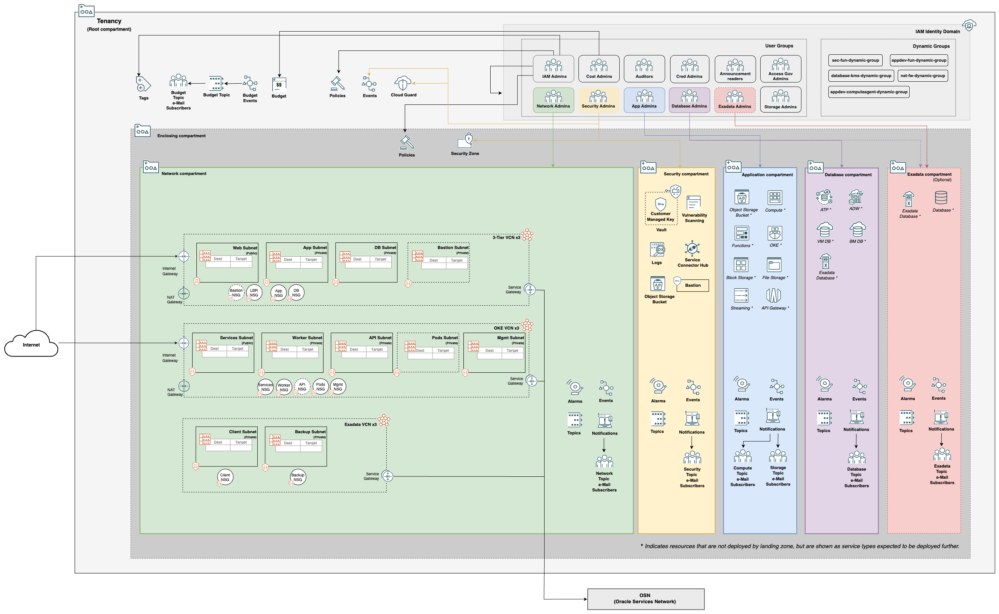
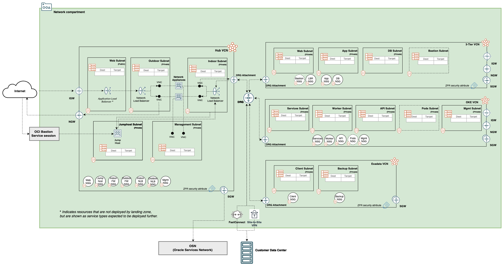
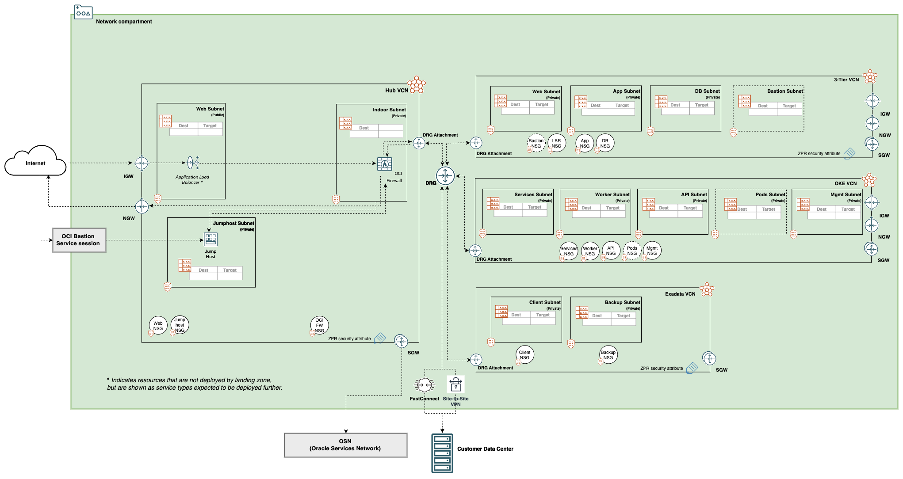

[](https://cloud.oracle.com/resourcemanager/stacks/create?zipUrl=https://github.com/oci-landing-zones/terraform-oci-core-landingzone/archive/refs/heads/main.zip)<br>
*If you are logged into your OCI tenancy in the Commercial Realm (OC1), the button will take you directly to OCI Resource Manager where you can proceed to deploy. If you are not logged, the button takes you to Oracle Cloud initial page where you must enter your tenancy name and login to OCI.*
<br>
<details><summary>To deploy to non-commercial realms and regions click here:</summary>

**OC2 Realm**
- [ Deploy to us-langley-1](https://console.us-langley-1.oraclegovcloud.com/resourcemanager/stacks/create?zipUrl=https://github.com/oci-landing-zones/terraform-oci-core-landingzone/archive/refs/heads/main.zip)
- [Deploy to us-luke-1](https://console.us-luke-1.oraclegovcloud.com/resourcemanager/stacks/create?zipUrl=https://github.com/oci-landing-zones/terraform-oci-core-landingzone/archive/refs/heads/main.zip)

**OC3 Realm**
- [Deploy to us-gov-ashburn-1](https://console.us-gov-ashburn-1.oraclegovcloud.com/resourcemanager/stacks/create?zipUrl=https://github.com/oci-landing-zones/terraform-oci-core-landingzone/archive/refs/heads/main.zip)
- [Deploy to us-gov-chicago-1](https://console.us-gov-chicago-1.oraclegovcloud.com/resourcemanager/stacks/create?zipUrl=https://github.com/oci-landing-zones/terraform-oci-core-landingzone/archive/refs/heads/main.zip)
- [Deploy to us-gov-phoenix-1](https://console.us-gov-phoenix-1.oraclegovcloud.com/resourcemanager/stacks/create?zipUrl=https://github.com/oci-landing-zones/terraform-oci-core-landingzone/archive/refs/heads/main.zip)

**OC4 Realm**
- [Deploy to uk-gov-london-1](https://console.uk-gov-london-1.oraclegovcloud.uk/resourcemanager/stacks/create?zipUrl=https://github.com/oci-landing-zones/terraform-oci-core-landingzone/archive/refs/heads/main.zip)
- [Deploy to uk-gov-cardiff-1](https://console.uk-gov-cardiff-1.oraclegovcloud.uk/resourcemanager/stacks/create?zipUrl=https://github.com/oci-landing-zones/terraform-oci-core-landingzone/archive/refs/heads/main.zip)

**OC10 Realm**
- [Deploy to ap-dcc-canberra-1](https://oc10.cloud.oracle.com/resourcemanager/stacks/create?zipUrl=https://github.com/oci-landing-zones/terraform-oci-core-landingzone/archive/refs/heads/main.zip)

**OC19 Realm**
- [Deploy to eu-frankfurt-2](https://cloud.oracle.eu/resourcemanager/stacks/create?zipUrl=https://github.com/oci-landing-zones/terraform-oci-core-landingzone/archive/refs/heads/main.zip&region=eu-frankfurt-2)
- [Deploy to eu-madrid-2](https://cloud.oracle.eu/resourcemanager/stacks/create?zipUrl=https://github.com/oci-landing-zones/terraform-oci-core-landingzone/archive/refs/heads/main.zip&region=eu-madrid-2)

</details>
<br>

# OCI Core Landing Zone


## Table of Contents

1. [Overview](#overview)
1. [Architecture](#arch)
    1. [IAM](#arch-iam)
    1. [Network](#arch-network)
    1. [Diagram](#arch-diagram)
    1. [Mapping to CIS OCI Benchmark v2.0](./ARCH-MAPPING-CIS.md)
1. [Requirements](#requirements)
1. [Deployment Scenarios](#deployment-scenarios)
1. [CIS OCI Foundations Benchmark Modules Collection](#modules)
1. [Contributing](#contributing)
1. [License](#license)
1. [Known Issues](#known-issues)

## <a name="overview">Overview</a>

The OCI Core Landing Zone unifies the OCI landing zone initiatives that follow a centralized deployment paradigm for provisioning the base tenancy, including [CIS Landing Zone](https://github.com/oci-landing-zones/oci-cis-landingzone-quickstart) and [Oracle Enterprise Landing Zone](https://github.com/oci-landing-zones/oracle-enterprise-landingzone). For deploying landing zones in multiple stacks, see [The OCI Operating Entities Landing Zone](https://github.com/oci-landing-zones/oci-landing-zone-operating-entities).

The OCI Core Landing Zone deploys a standardized environment in an Oracle Cloud Infrastructure (OCI) tenancy that helps organizations to comply with the [CIS OCI Foundations Benchmark v2.0](https://www.cisecurity.org/benchmark/oracle_cloud/).

It uses multiple compartments, groups, and IAM policies to segregate access to resources based on job function. The resources are configured to meet the CIS OCI Foundations Benchmark settings related to:

- IAM (Identity & Access Management)
- Networking
- Cloud Guard
- Encryption Keys
- Logging
- Events
- Notifications
- Vulnerability Scanning
- Alarms
- Object Storage
- Budgets
- Security Zones

From a code architecture perspective, the OCI Core Landing Zone utilizes the modules available in the [CIS OCI Foundations Benchmark Modules Collection](#modules) for actual resource management.

From a functional perspective, the OCI Core Landing Zone adds the following to CIS Landing Zone:

1. Ability to use groups and dynamic groups from an existing Identity Domain as the grantees of IAM policies.
2. Streamlined user interface in Resource Manager, for better usability and improved customization.
3. Ability to deploy VCNs for OKE workload deployments, in addition to three-tier and Exadata Cloud service VCNs.
4. Ability to deploy a network firewall (OCI native or third party appliance) in the Hub VCN (a.k.a. DMZ VCN).
5. Ability to route traffic between select spoke VCNs, or in a full mesh model.
6. Ability to deploy a Bastion service in a Jump Host in the Hub VCN 


## <a name="arch">Architecture</a>

### <a name="arch-iam">IAM</a>

The OCI Core Landing Zone creates specific compartments in the tenancy root compartment or under an enclosing compartment:
 - Network compartment: for all networking resources.
 - Security compartment: for all logging, key management, scanning, and notifications resources.
 - Application Development compartment: for application development related services, including Compute, Storage, Functions, Streams, Kubernetes, API Gateway, etc.
 - Database compartment: for all database resources.
 - Exadata infrastructure compartment: this is an optional compartment. While preparing for deploying Exadata Cloud Service, customers can choose between creating a specific compartment or using the Database compartment.
 - Enclosing compartment: a compartment at any level in the compartment hierarchy to hold the above compartments.

The compartment design reflects a basic functional structure observed across different organizations, where IT responsibilities are typically split among networking, security, application development and database admin teams. Each compartment is assigned an admin group, with enough permissions to perform its duties. The provided permissions lists are not exhaustive and are expected to be appended with new statements as new resources are brought into the Terraform template.

### <a name="arch-networking">Networking</a>

A single landing zone deployment can create up to ten (10) VCNs: three (3) three-tier VCNs, three (3) Exadata Cloud Service VCNs, three (3) OKE VCNs and one (1) Hub VCN. The VCNs can be standalone or peered. By the default, no VCNs are deployed.

The three-tier VCNs are comprised of:

 - One public (by default) subnet for load balancers.
 - Two private subnets: one for the application tier and one for the database tier.
 - One optional subnet for bastion deployment. The subnet configuration supports the further deployment of OCI Bastion service (private subnet) or jump hosts (public subnet).

The Exadata VCNs are comprised of:

- One private client subnet.
- One private backup subnet.

The OKE VCNs are comprised of:

- One public subnet for load balancers.
- Two private subnets: one for worker nodes, one for API endpoint.
- One optional subnet for Kubernetes pods deployment, supporting OCI native CNI (Container Networking Interface).
- One optional subnet for cluster management.

The Hub VCN is a choke point for external traffic that ingresses into the VCNs (either from Internet or on-premises) or from internal traffic generated by the spoke VCNs. It is comprised based on user options of:

Third Party firewall appliance option:

- One public subnet for load balancers.
- Two private subnets: one for inbound North-South traffic (from Internet or on-premises), one for inbound East-West (cross-spoke) traffic.
- One private subnet for managing the firewall appliance that is eventually deployed.
- One optional private subnet for Jump Host deployment where the Bastion service and on-premises access via FastConnect is supported


OCI Network Firewall option:

- One public subnet for Internet Gateway (IGW) North-South traffic passed through to the Network Firewall.
- One private subnet for the Network Firewall and East-West traffic from/to spoke VCNs.
- One optional private subnet for Jump Host deployment where the Bastion service and on-premises access via FastConnect is supported

The Hub VCN is coupled with a Dynamic Routing Gateway (DRG), that can be either an existing one or managed by the landing zone.

Some architecture scenarios enabled by the Hub VCN are:

- **Access to multiple VCNs in the same region:** This scenario enables communication between an on-premises network and multiple VCNs in the same region over a single FastConnect private virtual circuit or Site-to-Site VPN using a VCN as the hub.
- **Access between multiple networks through a single DRG with a firewall between networks:** This scenario connects several VCNs to a single DRG, with all routing configured to send packets through a firewall in a Hub VCN before they can be sent to another VCN.
- **Access to multiple networks through a Bastion service deployed on a Jump Host:** This scenario allows access to multiple VCNs from a single Jump Host in the Hub VCN using the Bastion service.

### <a name="arch-diagram">Diagrams</a>

The diagram below shows services and resources that are deployed along with a single three-tier VCN deployment:



[Get the diagram in SVG format.](./images/arch_simple.svg)

The diagram below expands the resources in the network compartment for covering the possibilities in a Hub & Spoke topology:



[Get the diagram in SVG format.](./images/arch-advanced-net-appliance.svg)

The diagram below expands the resources in the network compartment specifically with OCI Network Firewall in a Hub & Spoke topology:



[Get the diagram in SVG format.](./images/arch-advanced-oci-firewall.svg)

You can create up to three (3) three-tier VCNs, three (3) Exadata VCNs,and 3 Oracle Kubernetes Engine (OKE) VCNs in a single landing zone deployment.


## <a name="requirements">Requirements</a>

### Terraform Version >= 1.3.0

This module requires Terraform binary version 1.3.0 or greater, as its underlying modules rely on Optional Object Type Attributes feature. The feature shortens the amount of input values in complex object types, by having Terraform automatically inserting a default value for any missing optional attributes.

## <a name="deployment-scenarios">Deployment Scenarios</a>

Some deployment scenarios are available under the [templates](./templates/) folder:

- [Groups and Dynamic Groups From a Custom Identity Domains](./templates/custom-identity-domain)
- [No Networking](./templates/cis-basic/)
- [Single Three-Tier VCN with default settings](./templates/standalone-three-tier-vcn-defaults/)
- [Single Three-Tier VCN with ZPR enabled](./templates/standalone-three-tier-vcn-zpr/)
- [Single Three-Tier VCN with custom settings](./templates/standalone-three-tier-vcn-custom/)
- [Multiple Three-Tier VCNs peered through DRG](./templates/hub-spoke-with-drg-and-three-tier-vcns)
- [Multiple VCN types peered through a Hub VCN with native Network Firewall](./templates/hub-spoke-with-hub-vcn-net-firewall)
- [Multiple VCN types peered through a Hub VCN with third party network appliance](./templates/hub-spoke-with-hub-vcn-net-appliance)
- [Multiple VCN types peered through a Hub VCN with a Bastion Service enabled on a Jump Host](./templates/hub-spoke-with-hub-vcn-bastion-jump-host)

Another key deployment scenario of OCI Core Landing Zone is [Zero Trust Landing Zone](https://github.com/oci-landing-zones/terraform-oci-zero-trust-landingzone).

OCI Core Landing Zone release 1.2.0 offers **OCI Network Firewall** in a Hub VCN for use with Three Tier, Exadata and/or OKE networking.


## <a name="modules">CIS OCI Foundations Benchmark Modules Collection</a>

This repository uses a broader collection of repositories containing modules that help customers align their OCI implementations with the CIS OCI Foundations Benchmark recommendations:
- [Identity & Access Management](https://github.com/oci-landing-zones/terraform-oci-modules-iam)
- [Networking](https://github.com/oci-landing-zones/terraform-oci-modules-networking)
- [Governance](https://github.com/oci-landing-zones/terraform-oci-modules-governance)
- [Security](https://github.com/oci-landing-zones/terraform-oci-modules-security)
- [Observability & Monitoring](https://oci-landing-zones/terraform-oci-modules-observability)
- [Secure Workloads](https://github.com/oci-landing-zones/terraform-oci-modules-workloads)

The modules in this collection are designed for flexibility, are straightforward to use, and enforce CIS OCI Foundations Benchmark recommendations when possible.

Using these modules does not require a user extensive knowledge of Terraform or OCI resource types usage. Users declare a JSON object describing the OCI resources according to each module’s specification and minimal Terraform code to invoke the modules. The modules generate outputs that can be consumed by other modules as inputs, allowing for the creation of independently managed operational stacks to automate your entire OCI infrastructure.


## <a name="contributing">Contributing</a>

See [CONTRIBUTING.md](./CONTRIBUTING.md).


## <a name="license">License</a>

Copyright (c) 2024, Oracle and/or its affiliates.

Licensed under the Universal Permissive License v 1.0 as shown at https://oss.oracle.com/licenses/upl.

See [LICENSE](./LICENSE.txt) for more details.


## <a name="known-issues">Known Issues</a>

* **Network Firewall Policy Security Rule Deletion**
    * Terraform Destroy does not delete the OCI Network Firewall in a single pass. On the first attempt, there is a time out with the following error:
    ```
        Error: 409-IncorrectState, The Policy and its components can not be modified or deleted if the policy is attached to any firewall
    ```
    Running Terraform Destroy a second time succeeds and all resources are ready for deletion.

* **CIS Level and Firewall Functionality**
    * Deploying an optional firewall network appliance in conjunction with the option of CIS Level 2 is not supported at this time. This limitation is due to the requirement imposed by Security Zone for an encrypted boot volume with a customer managed key on the network appliance. The suggested workaround is to opt for CIS Level 1 if you intend to use a third party firewall. This is going to be addressed in a future release.

* **OCI ZPR Security Attribute Namespace Blocks Terraform Destroy**
    * If you use Zero Trust Packet Routing (ZPR), an active Security Attribute Namespace will block any Terraform destroy operation. This issue will be corrected, but for a workaround in the short-term, see [Retiring a Security Attribute Namespace](https://docs.oracle.com/en-us/iaas/Content/zero-trust-packet-routing/retire-security-attribute-namespace.htm). The Security Attribute Namespace, including all associated security attributes, can be retired manually via OCI console, CLI or API ***prior*** to running Terraform destroy.

* **Oracle Access Governance (OAG) Availability**
    * OAG is not currently available in all regions or outside of OCI commercial realms. For more details, see [What's New for Oracle Access Governance](https://docs.oracle.com/en/cloud/paas/access-governance/wsaje/). At the time of this Landing Zone release, OAG cannot deploy in any realm other than OC1.

* **OCI Marketplace Third Party Firewall Availability**
    * New with this release of Landing Zone is an optional selection of Palo Alto Networks VM-Series Next Genration Firewall or FortiGate Next-Gen Firewall (BYOL). These offerings are provided through the OCI Marketplace, which will vary by region and realm. Not all versions are released to all realms at the same time.

* **Terraform Apply Failure 404-NotAuthorizedorNotFound**
    * Terraform CLI or Resource Manager fails to apply with a message similar as this:
    ```
        2021/07/01 23:53:25[TERRAFORM_CONSOLE] [INFO]
        2021/07/01 23:53:25[TERRAFORM_CONSOLE] [INFO] Error: 404-NotAuthorizedOrNotFound
        2021/07/01 23:53:25[TERRAFORM_CONSOLE] [INFO] Provider version: 4.33.0, released on 2021-06-30.
        2021/07/01 23:53:25[TERRAFORM_CONSOLE] [INFO] Service: Identity Policy
        2021/07/01 23:53:25[TERRAFORM_CONSOLE] [INFO] Error Message: Authorization failed or requested resource not found
        2021/07/01 23:53:25[TERRAFORM_CONSOLE] [INFO] OPC request ID: f14a700dc5d00272933a327c8feb2871/5053FB2DA16689F6421821A1B178D450/D3F2FE52F3BF8FB2C769AEFF7754A9B0
        2021/07/01 23:53:25[TERRAFORM_CONSOLE] [INFO] Suggestion: Either the resource has been deleted or service Identity Policy need policy to access this resource. Policy reference: https://docs.oracle.com/en-us/iaas/Content/Identity/Reference/policyreference.htm
    ```

    This is due to eventual consistency, where resources need to be propagated to all regions before becoming fully available. We have dealt with these type of issues in code by introducing artificial delays. However, they may still arise as the consistency is eventual. If you face errors like this, simply re-plan and re-apply the Terraform configuration (you do not need to destroy and start all over). The errors should go away in the subsequent run. If they still persist, the problem is of a different nature.

    **If your plan continues to fail, please ensure the OCI service is available in your realm. All OCI services deployed by OCI Core Landing Zone are available in the commercial (OC1) realm but may not be in others.**

* **OCI Compartment Deletion**
    * By design, OCI compartments are not deleted upon *terraform destroy* by default. Deletion can be enabled in Landing Zone by setting *enable_cmp_delete* variable to true in locals.tf file. However, compartments may take a long time to delete. Not deleting compartments is OK if you plan on reusing them. For more information about deleting compartments in OCI via Terraform, check [OCI Terraform provider documentation](https://registry.terraform.io/providers/hashicorp/oci/latest/docs/resources/identity_compartment).

* **OCI Vault Deletion**
    * By design, OCI vaults and keys are not deleted immediately upon *terraform destroy*, but scheduled for deletion. Both have a default 30 day grace period. For shortening that period, use OCI Console to first cancel the scheduled deletion and then set the earliest possible deletion date (7 days from current date) when deleting.

* **Support for free tier tenancies**
    * Deploying in a free tier tenancy is not supported at this time as there are some services that are not available. If you want to try the Landing Zone please upgrade your account to a Pay As You Go (PAYG) account.

* **Logging Analytics Enablement**
    * Attempting to onboard your tenancy to Logging Analytics more than once will cause errors.

* **Provisioning Objects Storage with Terraform**
    * Object Storage namespace can sometimes fail in long running deployments because of Terraform provision order.

