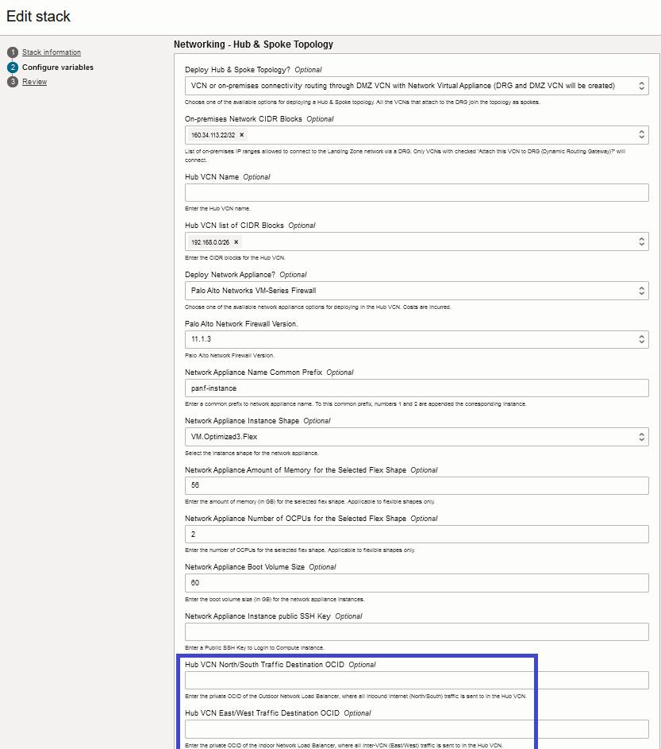
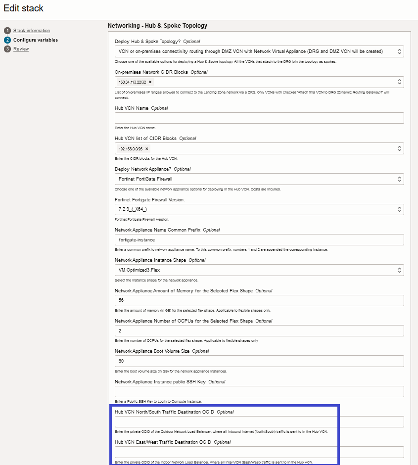

# Core Landing Zone With Hub/Spoke DRG with Network Firewall Topology Template

This template shows how to deploy a CIS compliant landing zone using [OCI Core Landing Zone](../../) configuration with a Hub/Spoke networking topology including either Fortinet's Fortigate Firewall or Palo Alto Networks Firewall. Both configurations are mostly the same, except for the network appliance option (_hub\_vcn\_deploy\_net\_appliance\_option_) and their respective settings (_net\_appliance\__ variables).

Deploying a network firewall appliance requires the same Terraform configuration executed twice. The first time it creates all the networking resources, except the required routing to the network load balancers that front end the network appliances (that are also created in the first run). So the second time execution is to update the configuration with that routing.

The variables to update for the second time execution are **hub_vcn_north_south_entry_point_ocid** and **hub_vcn_east_west_entry_point_ocid**. And their values are available in the **nlb_private_ip_addresses** output. 
- **hub_vcn_north_south_entry_point_ocid** takes the OCID value in **nlb_private_ip_addresses.OUTDOOR-NLB**
- **hub_vcn_east_west_entry_point_ocid** takes the OCID value in **nlb_private_ip_addresses.INDOOR_NLB**.

## Deployment Scenario 1: Fortinet Firewall

It deploys Fortinet Firewall, Hub VCN, Exa VCN and OKE VCN which are peered through the DRG. The DRG is configured to route traffic across all VCNs.

Please see other [templates](../../templates/) available for CIS compliant landing zones with custom configurations.

### Default Values

This template has the following parameters set: 

| Variable Name | Description | Value |
|---------------|-------------|-------|
| service_label | A unique identifier to prefix the resources | abcde |
| define_net | Check to define networking resources. By default, the Landing Zone does NOT deploy any networks.     | true |
| hub_deployment_option | The hub deployment option. In this case, a DRG is deployed to act as the hub in the Hub/Spoke topology. | "VCN or on-premises connectivity routing through DMZ VCN with Network Virtual Appliance (DRG and DMZ VCN will be created)" |
| hub_vcn_cidrs | Hub VCN list of CIDR Blocks | ["192.168.0.0/26"]|
| hub_vcn_deploy_net_appliance_option | Choose one of the available network appliance options for deploying in the Hub VCN.| Fortinet FortiGate Firewall |
| net_fortigate_version | Fortinet Fortigate Firewall Version. | 7.2.9_(\_X_64) or 7.4.4_(\_X_64) |
| net_appliance_flex_shape_memory | Network Appliance Amount of Memory for the Selected Flex Shape | 56 |
| net_appliance_flex_shape_cpu |Network Appliance Number of OCPUs for the Selected Flex Shape | 2 |
| net_appliance_boot_volume_size | Network Appliance Boot Volume Size | 60 |
| net_appliance_public_rsa_key | Network Appliance Instance public SSH Key | Enter Public SSH Key |
| net_appliance_shape | Network Appliance Instance Shape | VM.Standard.E4.Flex |
| add_tt_vcn1 | When true, deploys three-tier VCN 1, with three subnets: web (public by default), application (private) and database (private). An optional subnet (private by default) for bastion deployment is also available     | true |
| tt_vcn1_cidrs | Three-tier VCN 1 CIDR blocks. | ["10.0.0.0/20"] |
| tt_vcn1_attach_to_drg | When true, attaches three-tier VCN 1 to the DRG | true |
| add_exa_vcn1 | VCN configured for Exadata Cloud Service deployment. | true |
| exa_vcn1_cidrs | Exa VCN 1 CIDR blocks. | ["172.16.0.0/20"] |
| exa_vcn1_attach_to_drg | When true, the VCN is attached to a DRG, enabling cross-vcn traffic routing | true |
| add_oke_vcn1 | Add OKE VCN | true |
| oke_vcn1_cni_type | OKE CNI Type | "Native" |
| oke_vcn1_cidrs | OKE VCN 1 CIDR Block. | ["10.3.0.0/16"]|
| oke_vcn1_attach_to_drg | Attach this VCN to DRG (Dynamic Routing Gateway) | true |
| hub_vcn_north_south_entry_point_ocid | The OCID of a private address the Hub VCN routes traffic to for inbound external traffic (North/South). It must be updated for the second execution of the configuration. | Initially null. For the second time execution, it is the OCID of the outdoor network load balancer's private IP address. This is available in the output nlb_private_ip_addresses.OUTDOOR-NLB. |
| hub_vcn_east_west_entry_point_ocid | The OCID of a private address the Hub VCN routes traffic to for inbound internal cross-vcn traffic (East/West). It must be updated for the second execution of the configuration. | Initially null. For the second time execution, it is the OCID of the indoor network load balancer's private IP address. This is available in the output nlb_private_ip_addresses.INDOOR_NLB. |
| network_admin_email_endpoints | List of email addresses that receive notifications for networking related events. | ["email.address@example.com"] |
| security_admin_email_endpoints | List of email addresses that receive notifications for security related events. | ["email.address@example.com"] |
| enable_cloud_guard | When true, OCI Cloud Guard Service is enabled. Set to false if it's been already enabled through other means. | true |
| create_budget | Create a default budget | true |
| budget_alert_threshold | Percentage of Budget | 100 |
| budget_amount | Monthly Budget Amount (in US$) | 1000|
| budget_alert_email_endpoints | Budget Alert Email Endpoints | ["email.address@example.com"] |


For a detailed description of all variables that can be used, see the [Variables](../../VARIABLES.md) documentation.

This template can be deployed using OCI Resource Manager Service (RMS) or Terraform CLI:

### OCI RMS Deployment

By clicking the button below, you are redirected to an OCI RMS Stack with variables pre-assigned for deployment. 

[](https://cloud.oracle.com/resourcemanager/stacks/create?zipUrl=https://github.com/oci-landing-zones/terraform-oci-core-landingzone/archive/refs/heads/main.zip&zipUrlVariables={"service_label":"fortinet","define_net":true,"hub_deployment_option":"VCN%20or%20on-premises%20connectivity%20routing%20via%20DRG%20(DRG%20will%20be%20created)","hub_vcn_cidrs":["192.168.0.0/26"],"hub_vcn_deploy_net_appliance_option":"Fortinet%20FortiGate%20Firewall","net_fortigate_version":"7.2.9%20(X64)%20","net_appliance_flex_shape_memory":"56","net_appliance_flex_shape_cpu":"2","net_appliance_boot_volume_size":"60","net_appliance_public_rsa_key":"Enter%20Public%20SSH%20Key","net_appliance_shape":"VM.Standard.E4.Flex","add_tt_vcn1":true,"tt_vcn1_cidrs":["10.0.0.0/20"],"tt_vcn1_attach_to_drg":true,"add_exa_vcn1":true,"exa_vcn1_cidrs":["172.16.0.0/20"],"exa_vcn1_attach_to_drg":true,"add_oke_vcn1":true,"oke_vcn1_cni_type":"Native","oke_vcn1_cidrs":["10.3.0.0/16"],"oke_vcn1_attach_to_drg":true,"network_admin_email_endpoints":["email.address@example.com"],"security_admin_email_endpoints":["email.address@example.com"],"enable_cloud_guard":true,"create_budget":true,"budget_alert_threshold":"100","budget_amount":"1000","budget_alert_email_endpoints":["email.address@example.com"]})

You are required to review/adjust the following variable settings:
 - Make sure to pick an OCI region for deployment.
 - Provide real email addresses for *Network Admin Email Endpoints* and *Security Admin Email Endpoints* fields. 
 - Uncheck *Enable Cloud Guard Service* option in case it is already enabled in your tenancy.

With the stack created, perform a Plan, followed by an Apply using RMS UI.

Once the Apply finishes, RMS displays the stack output under the **Application information** tab. Under Networking, there is an output named **Network Load Balancers (NLB) Private IP Addresses**, whose value looks like:
```
{"INDOOR_NLB":{"id":"ocid1.privateip.oc1.phx.abyhql...goq"},"OUTDOOR-NLB":{"id":"ocid1.privateip.oc1.phx.abyhql...4ga"}}
```

Edit the RMS stack variables to update the routings to the network appliance using the values above. 
- Enter the id value in OUTDOOR-NLB ("ocid1.privateip.oc1.phx.abyhql...4ga") to update **Hub VCN North/South Traffic Destination OCID** field.
- Enter the id value in INDOOR_NLB ("ocid1.privateip.oc1.phx.abyhql...goq") to update **Hub VCN East/West Traffic Destination OCID** field.



Perform a new Plan, followed by an Apply.

### Terraform CLI Deployment

1. Rename file *main.tf.fortinet.template* to *main.tf*. 
2. Provide/review the variable assignments in *main.tf*.
3. In this folder, execute the typical Terraform workflow:
    - $ terraform init
    - $ terraform plan
    - $ terraform apply
4. Take note of the values in the output **nlb_private_ip_addresses**.
5. Uncomment and update the variables **hub_vcn_north_south_entry_point_ocid** and **hub_vcn_north_south_entry_point_ocid** as instructed in *main.tf.fortinet.template*.
6. In this folder, execute Terraform plan and apply again:
    - $ terraform plan
    - $ terraform apply

## Deployment Scenario 2: Palo Alto Firewall

It deploys Palo Alto Firewall, Hub VCN, Exa VCN and OKE VCN which are peered through the DRG. The DRG is configured to route traffic across all VCNs.

Please see other [templates](../../templates/) available for CIS compliant landing zones with custom configurations.

### Default Values

This template has the following parameters set: 

| Variable Name | Description | Value |
|---------------|-------------|-------|
| service_label | A unique identifier to prefix the resources | abcde |
| define_net | Check to define networking resources. By default, the Landing Zone does NOT deploy any networks.     | true |
| hub_deployment_option | The hub deployment option. In this case, a DRG is deployed to act as the hub in the Hub/Spoke topology. | "VCN or on-premises connectivity routing through DMZ VCN with Network Virtual Appliance (DRG and DMZ VCN will be created)" |
| hub_vcn_cidrs | Hub VCN list of CIDR Blocks | ["192.168.0.0/26"]|
| hub_vcn_deploy_net_appliance_option | Choose one of the available network appliance options for deploying in the Hub VCN.| Palo Alto Networks VM-Series Firewall |
| net_palo_alto_version | Palo Alto Network Firewall Version. | 11.1.3 or 11.1.2-h3 |
| net_appliance_flex_shape_memory | Network Appliance Amount of Memory for the Selected Flex Shape | 56 |
| net_appliance_flex_shape_cpu |Network Appliance Number of OCPUs for the Selected Flex Shape | 2 |
| net_appliance_boot_volume_size | Network Appliance Boot Volume Size | 60 |
| net_appliance_public_rsa_key | Network Appliance Instance public SSH Key | Enter Public SSH Key |
| net_appliance_shape | Network Appliance Instance Shape | VM.Standard2.4 |
| add_tt_vcn1 | When true, deploys three-tier VCN 1, with three subnets: web (public by default), application (private) and database (private). An optional subnet (private by default) for bastion deployment is also available     | true |
| tt_vcn1_cidrs | Three-tier VCN 1 CIDR blocks. | ["10.0.0.0/20"] |
| tt_vcn1_attach_to_drg | When true, attaches three-tier VCN 1 to the DRG | true |
| add_exa_vcn1 | VCN configured for Exadata Cloud Service deployment. | true |
| exa_vcn1_cidrs | Exa VCN 1 CIDR blocks. | ["172.16.0.0/20"] |
| exa_vcn1_attach_to_drg | When true, the VCN is attached to a DRG, enabling cross-vcn traffic routing | true |
| add_oke_vcn1 | Add OKE VCN | true |
| oke_vcn1_cni_type | OKE CNI Type | "Native" |
| oke_vcn1_cidrs | OKE VCN 1 CIDR Block. | ["10.3.0.0/16"]|
| oke_vcn1_attach_to_drg | Attach this VCN to DRG (Dynamic Routing Gateway) | true |
| hub_vcn_north_south_entry_point_ocid | The OCID of a private address the Hub VCN routes traffic to for inbound external traffic (North/South). It must be updated for the second execution of the configuration. | Initially null. For the second time execution, it is the OCID of the outdoor network load balancer's private IP address. This is available in the output nlb_private_ip_addresses.OUTDOOR-NLB. |
| hub_vcn_east_west_entry_point_ocid | The OCID of a private address the Hub VCN routes traffic to for inbound internal cross-vcn traffic (East/West). It must be updated for the second execution of the configuration. | Initially null. For the second time execution, it is the OCID of the indoor network load balancer's private IP address. This is available in the output nlb_private_ip_addresses.INDOOR_NLB. |
| network_admin_email_endpoints | List of email addresses that receive notifications for networking related events. | ["email.address@example.com"] |
| security_admin_email_endpoints | List of email addresses that receive notifications for security related events. | ["email.address@example.com"] |
| enable_cloud_guard | When true, OCI Cloud Guard Service is enabled. Set to false if it's been already enabled through other means. | true |
| create_budget | Create a default budget | true |
| budget_alert_threshold | Percentage of Budget | 100 |
| budget_amount | Monthly Budget Amount (in US$) | 1000|
| budget_alert_email_endpoints | Budget Alert Email Endpoints | ["email.address@example.com"] |


For a detailed description of all variables that can be used, see the [Variables](../../VARIABLES.md) documentation.

This template can be deployed using OCI Resource Manager Service (RMS) or Terraform CLI:

### OCI RMS Deployment

By clicking the button below, you are redirected to an OCI RMS Stack with variables pre-assigned for deployment. 

[](https://cloud.oracle.com/resourcemanager/stacks/create?zipUrl=https://github.com/oci-landing-zones/terraform-oci-core-landingzone/archive/refs/heads/main.zip&zipUrlVariables={"service_label":"paloalto","define_net":true,"hub_deployment_option":"VCN%20or%20on-premises%20connectivity%20routing%20via%20DRG%20(DRG%20will%20be%20created)","hub_vcn_cidrs":["192.168.0.0/26"],"hub_vcn_deploy_net_appliance_option":"Palo%20Alto%20Networks%20VM-Series%20Firewall","net_palo_alto_version":"11.1.3%20","net_appliance_flex_shape_memory":"56","net_appliance_flex_shape_cpu":"2","net_appliance_boot_volume_size":"60","net_appliance_public_rsa_key":"Enter%20Public%20SSH%20Key","net_appliance_shape":"VM.Standard2.4","add_tt_vcn1":true,"tt_vcn1_cidrs":["10.0.0.0/20"],"tt_vcn1_attach_to_drg":true,"add_exa_vcn1":true,"exa_vcn1_cidrs":["172.16.0.0/20"],"exa_vcn1_attach_to_drg":true,"add_oke_vcn1":true,"oke_vcn1_cni_type":"Native","oke_vcn1_cidrs":["10.3.0.0/16"],"oke_vcn1_attach_to_drg":true,"network_admin_email_endpoints":["email.address@example.com"],"security_admin_email_endpoints":["email.address@example.com"],"enable_cloud_guard":true,"create_budget":true,"budget_alert_threshold":"100","budget_amount":"1000","budget_alert_email_endpoints":["email.address@example.com"]})

You are required to review/adjust the following variable settings:
 - Make sure to pick an OCI region for deployment.
 - Provide real email addresses for *Network Admin Email Endpoints* and *Security Admin Email Endpoints* fields. 
 - Uncheck *Enable Cloud Guard Service* option in case it is already enabled in your tenancy.

With the stack created, perform a Plan, followed by an Apply using RMS UI.

Once the Apply finishes, RMS displays the stack output under the **Application information** tab. Under Networking, there is an output named **Network Load Balancers (NLB) Private IP Addresses**, whose value looks like:
```
{"INDOOR_NLB":{"id":"ocid1.privateip.oc1.phx.abyhql...goq"},"OUTDOOR-NLB":{"id":"ocid1.privateip.oc1.phx.abyhql...4ga"}}
```

Edit the RMS stack variables to update the routings to the network appliance using the values above. 
- Enter the id value in OUTDOOR-NLB ("ocid1.privateip.oc1.phx.abyhql...4ga") to update **Hub VCN North/South Traffic Destination OCID** field.
- Enter the id value in INDOOR_NLB ("ocid1.privateip.oc1.phx.abyhql...goq") to update **Hub VCN East/West Traffic Destination OCID** field.



Perform a new Plan, followed by an Apply.

### Terraform CLI Deployment

1. Rename file *main.tf.paloalto.template* to *main.tf*. 
2. Provide/review the variable assignments in *main.tf*.
3. In this folder, execute the typical Terraform workflow:
    - $ terraform init
    - $ terraform plan
    - $ terraform apply
4. Take note of the values in the output **nlb_private_ip_addresses**.
5. Uncomment and update the variables **hub_vcn_north_south_entry_point_ocid** and **hub_vcn_north_south_entry_point_ocid** as instructed in *main.tf.paloalto.template*.
6. In this folder, execute Terraform plan and apply again:
    - $ terraform plan
    - $ terraform apply    

