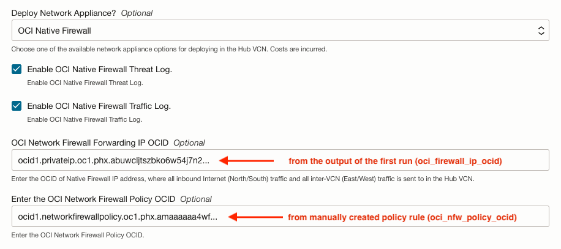

# Core Landing Zone with Hub & Spoke Topology, Including Native OCI Network Firewall Template

This template shows how to deploy a CIS compliant landing zone using [OCI Core Landing Zone](../../) configured with a Hub & Spoke networking topology including OCI Network Firewall. It deploys Network Firewall in the Hub VCN, a Three Tier VCN, an Exadata VCN and an OKE VCN which are peered through the DRG. The DRG is configured to route traffic across all VCNs.

Deploying a native OCI Network Firewall requires the Terraform configuration executed twice. With the first pass, it creates all the networking resources, except the required routing to the Network Firewall forwarding IP address created in the first run. The second pass updates the configuration with that routing and optionally, with a new default firewall policy created separately.

The variable to update for the second time execution is *OCI Network Firewall Forwarding IP OCID* and the value is available in the **oci\_firewall\_ip\_ocid** output.

- **oci\_nfw\_ip\_ocid** takes the OCID value of **oci\_firewall\_ip\_ocid**

If created between runs, use your own OCI Network Firewall Policy OCID at the same time in the second time execution.

- **oci\_nfw\_policy\_ocid** takes the OCID value as a replacement for the initial policy that rejects all traffic.

Please see other [templates](../../templates/) available for CIS compliant landing zones with custom configurations.

## Default Values

This template has the following parameters set:

| Variable Name | Description | Value |
|---------------|-------------|-------|
| service\_label | A unique identifier to prefix the resources | ocinetfw |
| define\_net | Check to define networking resources. By default, the Landing Zone does NOT deploy any networks. | true |
| hub\_deployment\_option | The hub deployment option. In this case, a DRG is deployed to act as the hub in the Hub/Spoke topology. | "VCN or on-premises connectivity routing through DMZ VCN with Network Virtual Appliance (DRG and DMZ VCN will be created)" |
| hub\_vcn\_cidrs | Hub VCN list of CIDR Blocks | ["192.168.0.0/26"]|
| hub\_vcn\_deploy\_net\_appliance\_option | Choose one of the available network appliance options for deploying in the Hub VCN. | OCI Native Firewall |
| enable\_native\_firewall\_threat\_log | Enable OCI Native Firewall Threat Log. | true |
| enable\_native\_firewall\_traffic\_log | Enable OCI Native Firewall Traffic Log. | true |
| add\_tt\_vcn1 | When true, deploys three-tier VCN 1, with three subnets: web (public by default), application (private) and database (private). An optional subnet (private by default) for bastion deployment is also available | true |
| tt\_vcn1\_cidrs | Three-tier VCN 1 CIDR blocks. | ["10.0.0.0/20"] |
| tt\_vcn1\_attach\_to\_drg | When true, attaches three-tier VCN 1 to the DRG | true |
| add\_exa\_vcn1 | VCN configured for Exadata Cloud Service deployment. | true |
| exa\_vcn1\_cidrs | Exa VCN 1 CIDR blocks. | ["172.16.0.0/20"] |
| exa\_vcn1\_attach\_to\_drg | When true, the VCN is attached to a DRG, enabling cross-vcn traffic routing | true |
| add\_oke\_vcn1 | Add OKE VCN | true |
| oke\_vcn1\_cni\_type | OKE CNI Type | "Native" |
| oke\_vcn1\_cidrs | OKE VCN 1 CIDR Block. | ["10.3.0.0/16"]|
| oke\_vcn1\_attach\_to\_drg | Attach this VCN to DRG (Dynamic Routing Gateway) | true |
| network\_admin\_email\_endpoints | List of email addresses that receive notifications for networking related events. | ["email.address@example.com"] |
| security\_admin\_email\_endpoints | List of email addresses that receive notifications for security related events. | ["email.address@example.com"] |
| enable\_cloud\_guard | When true, OCI Cloud Guard Service is enabled. Set to false if it's been already enabled through other means. | false |
| *Used during second `terraform apply`:* | | |
| oci\_nfw\_ip\_ocid | OCI Native Firewall Forwarding IP OCID, Update Route Rules. | ["ocid1.privateip.oc1.phx.abuwclj...goq"] |
| oci\_nfw\_policy\_ocid | User created OCI Network Firewall Policy OCID | ["ocid1.networkfirewallpolicy.oc1.phx.amaaaa...gmm"] |

For a detailed description of all variables that can be used, see the [Variables](../../VARIABLES.md) documentation.

This template can be deployed using OCI Resource Manager Service (RMS) or Terraform CLI:

## OCI RMS Deployment

By clicking the button below, you are redirected to an OCI RMS Stack with variables pre-assigned for deployment.

[](https://cloud.oracle.com/resourcemanager/stacks/create?zipUrl=https://github.com/oci-landing-zones/terraform-oci-core-landingzone/archive/refs/heads/main.zip&zipUrlVariables={"service_label":"ocinetfw","define_net":true,"hub_deployment_option":"VCN%20or%20on-premises%20connectivity%20routing%20through%20DMZ%20VCN%20with%20Network%20Virtual%20Appliance%20%28DRG%20and%20DMZ%20VCN%20will%20be%20created%29","hub_vcn_cidrs":["192.168.0.0/26"],"hub_vcn_deploy_net_appliance_option":"OCI%20Native%20Firewall","enable_native_firewall_threat_log":true,"enable_native_firewall_traffic_log":true,"add_tt_vcn1":true,"tt_vcn1_cidrs":["10.0.0.0/20"],"tt_vcn1_attach_to_drg":true,"add_exa_vcn1":true,"exa_vcn1_cidrs":["172.16.0.0/20"],"exa_vcn1_attach_to_drg":true,"add_oke_vcn1":true,"oke_vcn1_cni_type":"Native","oke_vcn1_cidrs":["10.3.0.0/16"],"oke_vcn1_attach_to_drg":true,"network_admin_email_endpoints":["email.address@example.com"],"security_admin_email_endpoints":["email.address@example.com"],"enable_cloud_guard":false})

You are required to review/adjust the following variable settings:

 - Make sure to pick an OCI region for deployment.
 - Provide real email addresses for *Network Admin Email Endpoints* and *Security Admin Email Endpoints* fields.
 - Uncheck *Enable Cloud Guard Service* option in case it is already enabled in your tenancy.

With the stack created, perform a Plan, followed by an Apply using RMS UI.

Once the Apply finishes, RMS displays the stack output under the **Application information** tab. Under Networking, there is an output named **oci\_firewall\_ip\_ocid**, whose value looks like:

```
Oci Firewall Ip Ocid:ocid1.privateip.oc1.phx.abyhql...goq
```

Edit the RMS stack to update the "OCI Network Firewall Forwarding IP OCID" using the determined value.

- Enter the forwarding IP OCID value ("ocid1.privateip.oc1.phx.abyhql...goq") to update **OCI Network Firewall Forwarding IP OCID** field.
- If created beforehand, provide an "OCI Network Firewall Policy OCID" to replace the initial default policy that rejects all traffic.



Perform a new Plan, followed by an Apply.

## Terraform CLI Deployment

1. Rename file *main.tf.template* to *main.tf*.
2. Provide/review the variable assignments in *main.tf*.
3. In this folder, execute the typical Terraform workflow:
    - $ terraform init
    - $ terraform plan
    - $ terraform apply
4. Take note of the value in the output **oci\_firewall\_ip\_ocid**.
5. Uncomment and update the variable **oci\_nfw\_ip\_ocid** as instructed in *main.tf.template*.
6. Optionally, provide a separately created policy OCID for **oci\_nfw\_policy\_ocid**
7. In this folder, execute Terraform plan and apply again:
    - $ terraform plan
    - $ terraform apply

